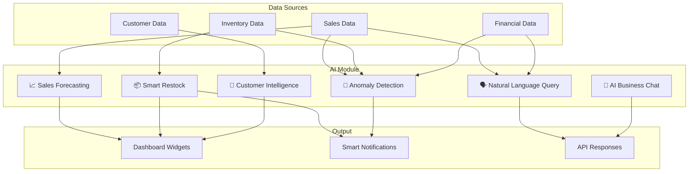
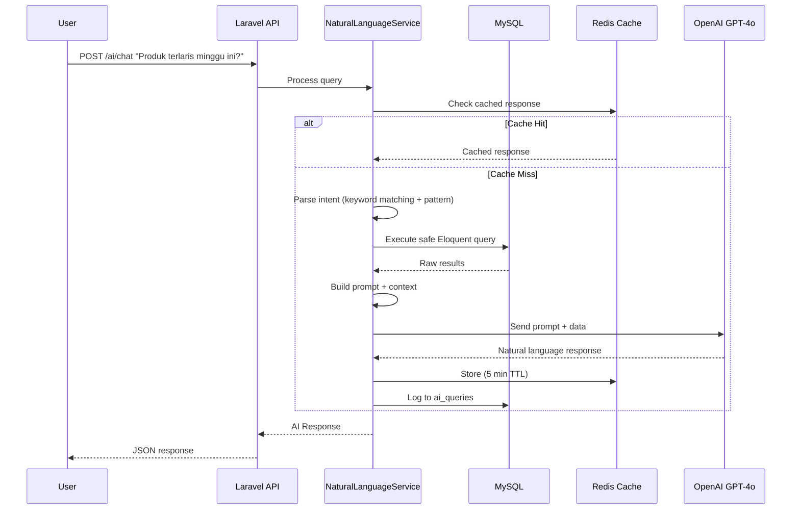

# VELORA — AI Module Architecture

> **Engine**: OpenAI GPT-4o API + Local Analytics  
> **Package**: `openai-php/laravel` (official Laravel SDK)  
> **Feature Gate**: AI features tied to subscription plan tier

---

## 1. AI Feature Overview



---

## 2. AI Features Detail

### Feature 1: Natural Language Business Query

**What**: Owner/admin asks questions in plain Bahasa Indonesia or English, AI answers with data.

```
User: "Produk apa yang paling laris minggu ini?"

AI Response:
"Produk terlaris minggu ini (12-18 Mei 2026):
 1. Kopi Susu Gula Aren — 342 pcs (Rp 5.130.000)
 2. Roti Bakar Coklat — 256 pcs (Rp 3.840.000)
 3. Es Teh Manis — 198 pcs (Rp 990.000)

📈 Kopi Susu Gula Aren naik 23% dari minggu lalu.
💡 Saran: Pertimbangkan stok tambahan untuk weekend."
```

**How it works**:
1. User sends query via API
2. `NaturalLanguageService` parses intent
3. System builds SQL/Eloquent query from intent (not raw SQL to AI)
4. Results formatted as context → sent to OpenAI with prompt
5. AI generates natural language summary
6. Response cached for identical queries (5 min TTL)

**Safety**: AI never executes raw SQL. System translates intent → safe Eloquent queries → sends results to AI for summarization only.

---

### Feature 2: Sales Forecasting

**What**: Predict sales volume for next 7/14/30 days per product or category.

```
Forecast for "Kopi Susu Gula Aren":
┌──────────┬───────────┬────────────┬────────────┐
│ Date     │ Predicted │ Lower 80%  │ Upper 80%  │
├──────────┼───────────┼────────────┼────────────┤
│ May 19   │ 48 pcs    │ 39 pcs     │ 57 pcs     │
│ May 20   │ 52 pcs    │ 42 pcs     │ 62 pcs     │
│ May 21   │ 45 pcs    │ 36 pcs     │ 54 pcs     │
│ ...      │ ...       │ ...        │ ...        │
└──────────┴───────────┴────────────┴────────────┘
```

**How it works**:
1. Daily scheduled job `GenerateDailyForecast`
2. Aggregates last 90 days of sales data per product
3. Sends structured data + context to OpenAI
4. AI returns predictions with confidence intervals
5. Results stored in `forecasts` table
6. Dashboard displays forecast charts

**Fallback**: If < 30 days of data, use simple moving average (no AI call).

---

### Feature 3: Intelligent Restock Suggestions

**What**: AI recommends what to reorder, how much, and when.

```
🔔 Restock Suggestions for Toko Sejahtera:

HIGH PRIORITY:
• Aqua 600ml — Stock: 24 pcs (min: 100)
  Saran: Order 5 dus (120 pcs) dari Supplier ABC
  Estimasi habis: 2 hari lagi
  
MEDIUM PRIORITY:
• Indomie Goreng — Stock: 48 pcs (min: 50)
  Saran: Order 2 karton (80 pcs) dari Supplier XYZ
  Estimasi habis: 5 hari lagi

LOW PRIORITY:
• Teh Botol 450ml — Stock: 200 pcs (min: 150)
  Trend: permintaan meningkat 15%/minggu
  Saran: Order minggu depan
```

**How it works**:
1. Triggered daily or when stock hits minimum threshold
2. Analyzes: current stock, daily sales velocity, lead time, supplier history
3. AI generates human-readable suggestions with quantities
4. Considers: seasonal trends, day-of-week patterns, upcoming holidays
5. Push notification to owner/admin

---

### Feature 4: Anomaly Detection

**What**: Detect unusual patterns that may indicate fraud, errors, or opportunities.

**Detected anomalies**:
| Type | Example |
|------|---------|
| **Revenue spike** | Sales 300% above normal on a Tuesday |
| **Revenue drop** | 50% below expected for 3 consecutive days |
| **Void abuse** | Cashier voided 15 transactions today (avg: 2) |
| **Discount abuse** | Same discount code used 50 times in 1 hour |
| **Stock mismatch** | System says 100 pcs, but 20 sold without stock movement |
| **Price anomaly** | Product sold below cost price |
| **Unusual hours** | Transaction at 3 AM when store closes at 10 PM |

**How it works**:
1. Scheduled job `DetectAnomalies` runs every 6 hours
2. Statistical analysis (standard deviation, z-score) on local data
3. Flagged anomalies sent to OpenAI for context + severity assessment
4. Results stored in `anomalies` table
5. High severity → immediate push notification
6. All anomalies → dashboard widget

---

### Feature 5: Customer Intelligence

**What**: AI-powered customer segmentation, churn prediction, and personalization.

```
Customer Segments (auto-generated):
┌───────────────┬──────┬────────────────────────────────┐
│ Segment       │ Count│ Characteristic                 │
├───────────────┼──────┼────────────────────────────────┤
│ Champions     │ 45   │ High frequency, high spend     │
│ Loyal         │ 120  │ Regular, moderate spend        │
│ At Risk       │ 35   │ Were active, declining visits  │
│ Lost          │ 80   │ No visit in 30+ days           │
│ New           │ 25   │ First purchase this month      │
└───────────────┴──────┴────────────────────────────────┘

Churn Alert:
"12 pelanggan Gold berisiko churn. Terakhir belanja > 21 hari.
 Saran: Kirim voucher diskon 15% via WhatsApp."
```

**How**: RFM analysis (Recency, Frequency, Monetary) computed locally → AI generates insights.

---

### Feature 6: AI Business Chat (Velora Assistant)

**What**: Interactive chat where owners ask anything about their business.

```
User: "Gimana performa toko bulan ini dibanding bulan lalu?"

Velora AI: "Performa Toko Sejahtera — Mei vs April 2026:

📊 Revenue: Rp 45.2 juta (+12.3%)
🛒 Transaksi: 1,847 (+8.5%)
🧾 Rata-rata: Rp 24.472 (+3.5%)
📦 Produk terjual: 5,230 pcs
💰 Gross Profit: Rp 15.8 juta (margin 35%)

Top Performa:
✅ Kopi Susu +23% 
✅ Roti Bakar +18%
⚠️ Es Jeruk -15% (turun karena musim hujan?)

Saran: Pertimbangkan menu hangat untuk boost penjualan musim hujan."
```

---

## 3. Database Tables (AI Module)

### `ai_queries`
| Column | Type | Constraints | Description |
|--------|------|-------------|-------------|
| id | CHAR(36) | PK | |
| business_id | CHAR(36) | FK→businesses | |
| user_id | CHAR(36) | FK→users | |
| type | VARCHAR(30) | NOT NULL | Enum: natural_query, forecast, restock, anomaly, chat |
| query_text | TEXT | NOT NULL | User's original question |
| context_data | JSON | NULLABLE | Data sent to AI as context |
| response_text | TEXT | NULLABLE | AI's response |
| model_used | VARCHAR(30) | DEFAULT 'gpt-4o' | OpenAI model |
| tokens_input | INT UNSIGNED | DEFAULT 0 | Input tokens used |
| tokens_output | INT UNSIGNED | DEFAULT 0 | Output tokens used |
| cost_usd | DECIMAL(10,6) | DEFAULT 0 | Estimated cost |
| response_time_ms | INT UNSIGNED | NULLABLE | Latency |
| rating | TINYINT | NULLABLE | User rating 1-5 |
| status | VARCHAR(20) | DEFAULT 'completed' | Enum: pending, completed, failed, cached |
| error_message | TEXT | NULLABLE | If failed |
| created_at | TIMESTAMP | | |

**Indexes**: `(business_id, type, created_at)`, `(user_id, created_at)`

### `forecasts`
| Column | Type | Constraints | Description |
|--------|------|-------------|-------------|
| id | CHAR(36) | PK | |
| business_id | CHAR(36) | FK→businesses | |
| branch_id | CHAR(36) | NULLABLE | |
| forecastable_type | VARCHAR(100) | NOT NULL | product, category, branch |
| forecastable_id | CHAR(36) | NOT NULL | |
| forecast_date | DATE | NOT NULL | Date being predicted |
| predicted_quantity | DECIMAL(15,4) | NOT NULL | |
| predicted_revenue | BIGINT UNSIGNED | DEFAULT 0 | |
| confidence_lower | DECIMAL(15,4) | NULLABLE | 80% CI lower |
| confidence_upper | DECIMAL(15,4) | NULLABLE | 80% CI upper |
| actual_quantity | DECIMAL(15,4) | NULLABLE | Filled after the day passes |
| accuracy_pct | DECIMAL(5,2) | NULLABLE | Calculated after actual |
| model_version | VARCHAR(20) | NULLABLE | |
| generated_at | TIMESTAMP | NOT NULL | When forecast was made |
| created_at | TIMESTAMP | | |

**Indexes**: `(business_id, forecastable_type, forecastable_id, forecast_date)`, `(business_id, forecast_date)`

### `anomalies`
| Column | Type | Constraints | Description |
|--------|------|-------------|-------------|
| id | CHAR(36) | PK | |
| business_id | CHAR(36) | FK→businesses | |
| branch_id | CHAR(36) | NULLABLE | |
| type | VARCHAR(30) | NOT NULL | revenue_spike, revenue_drop, void_abuse, discount_abuse, stock_mismatch, price_anomaly, unusual_hours |
| severity | VARCHAR(10) | NOT NULL | Enum: low, medium, high, critical |
| title | VARCHAR(200) | NOT NULL | Short description |
| description | TEXT | NOT NULL | AI-generated explanation |
| data_snapshot | JSON | NOT NULL | Raw data that triggered it |
| reference_type | VARCHAR(100) | NULLABLE | |
| reference_id | CHAR(36) | NULLABLE | |
| is_resolved | TINYINT(1) | DEFAULT 0 | |
| resolved_by | CHAR(36) | NULLABLE | |
| resolved_at | TIMESTAMP | NULLABLE | |
| resolved_note | TEXT | NULLABLE | |
| detected_at | TIMESTAMP | NOT NULL | |
| created_at | TIMESTAMP | | |
| updated_at | TIMESTAMP | | |

**Indexes**: `(business_id, severity, is_resolved)`, `(business_id, type, detected_at)`

### `ai_usage_logs`
| Column | Type | Constraints | Description |
|--------|------|-------------|-------------|
| id | CHAR(36) | PK | |
| business_id | CHAR(36) | FK→businesses | |
| month | DATE | NOT NULL | First day of month (for aggregation) |
| total_queries | INT UNSIGNED | DEFAULT 0 | |
| total_tokens | INT UNSIGNED | DEFAULT 0 | |
| total_cost_usd | DECIMAL(10,4) | DEFAULT 0 | |
| quota_limit | INT UNSIGNED | NOT NULL | Max queries for this month |
| created_at | TIMESTAMP | | |
| updated_at | TIMESTAMP | | |

**Indexes**: `UNIQUE(business_id, month)`

---

## 4. AI Integration Architecture

### OpenAI Integration Flow



### Prompt Engineering Strategy

```
Prompts are stored as dedicated PHP classes in Modules/AI/Prompts/

Each prompt class contains:
  - System prompt (role, language, format rules)
  - User prompt template (with data placeholders)
  - Output format instructions
  - Safety guardrails

Example — SalesAnalysisPrompt:
  System: "Kamu adalah asisten bisnis VELORA untuk UMKM Indonesia.
           Jawab dalam Bahasa Indonesia yang santai tapi profesional.
           Selalu sertakan angka dan insight actionable.
           Jangan berikan saran di luar data yang diberikan.
           Format output dengan emoji untuk readability."
  
  User: "Berdasarkan data penjualan berikut: {data_json}
         Pertanyaan user: {user_query}
         Berikan analisis dan saran yang relevan."
```

### Safety Guardrails

| Guard | Implementation |
|-------|---------------|
| **No raw SQL** | AI never sees or generates SQL; system builds Eloquent queries |
| **Data scope** | Only current tenant's data is sent to AI |
| **PII filtering** | Customer names/phones stripped before sending to OpenAI |
| **Output sanitization** | AI response sanitized before storing/displaying |
| **Token limit** | Max 4000 tokens per request (prevents cost explosion) |
| **Rate limit** | See quota table below |
| **Fallback** | If OpenAI is down, return cached/pre-computed analytics |

---

## 5. AI Feature Gating by Plan

| Feature | Trial | Starter | Professional | Enterprise |
|---------|-------|---------|-------------|------------|
| **AI Chat** | ❌ | 10 queries/month | 100 queries/month | 500 queries/month |
| **Sales Forecast** | ❌ | ❌ | Daily auto-forecast | Daily + on-demand |
| **Restock Suggestions** | ❌ | ❌ | Weekly | Daily |
| **Anomaly Detection** | ❌ | ❌ | ❌ | Every 6 hours |
| **Customer Intelligence** | ❌ | ❌ | Basic segments | Full RFM + churn |
| **Natural Language Query** | ❌ | 10/month | 50/month | 200/month |

Added `feature_limits` keys:
```
ai_chat_queries_per_month
ai_forecast_enabled
ai_forecast_frequency          (daily/weekly/none)
ai_restock_enabled
ai_restock_frequency           (daily/weekly/none)
ai_anomaly_enabled
ai_anomaly_frequency           (6h/12h/daily/none)
ai_customer_intelligence       (none/basic/full)
ai_nlq_queries_per_month
```

---

## 6. Queue Strategy for AI

| Job | Queue | Schedule | Timeout | Retry |
|-----|-------|----------|---------|-------|
| `GenerateDailyForecast` | reports | Daily 5:00 AM | 120s | 2 |
| `GenerateRestockSuggestions` | reports | Daily 6:00 AM | 90s | 2 |
| `DetectAnomalies` | reports | Every 6h | 120s | 1 |
| `ComputeCustomerSegments` | reports | Weekly Sunday | 180s | 1 |
| `ProcessAIChatQuery` | default | On-demand | 30s | 2 |
| `TrackAIUsage` | maintenance | End of day | 10s | 3 |

---

## 7. API Endpoints (AI Module)

```
POST   /api/v1/ai/chat                    → AI Business Chat
POST   /api/v1/ai/query                   → Natural Language Query
GET    /api/v1/ai/forecasts               → List forecasts
GET    /api/v1/ai/forecasts/{product_id}  → Product forecast
POST   /api/v1/ai/forecasts/generate      → Trigger forecast (on-demand)
GET    /api/v1/ai/restock-suggestions     → Current restock suggestions
GET    /api/v1/ai/anomalies               → List detected anomalies
PATCH  /api/v1/ai/anomalies/{id}/resolve  → Mark anomaly as resolved
GET    /api/v1/ai/customer-segments       → Customer segments
GET    /api/v1/ai/usage                   → AI usage stats for billing
GET    /api/v1/ai/insights/dashboard      → Dashboard insight widgets
```

---

## 8. Cost Management

### Estimated Cost per Request (OpenAI GPT-4o)

| Feature | Avg Tokens | Est. Cost/Request |
|---------|-----------|-------------------|
| Chat query | ~2000 | ~$0.01 |
| NL query | ~1500 | ~$0.008 |
| Daily forecast (per product) | ~1000 | ~$0.005 |
| Anomaly analysis | ~2000 | ~$0.01 |
| Customer segment | ~3000 | ~$0.015 |

### Monthly Cost Estimate per Tier

| Plan | Est. AI Queries/mo | Est. Cost/mo |
|------|-------------------|-------------|
| Starter | 20 | ~$0.20 |
| Professional | 250 | ~$2.50 |
| Enterprise | 800 | ~$8.00 |

> [!TIP]
> AI costs are very manageable. Platform absorbs costs at these volumes.
> For Enterprise custom plans with heavy usage, consider per-query pricing add-on.

### API Key Strategy

**Recommended**: Platform-level key (Velora pays)
- Simpler UX — users don't need their own OpenAI account
- Cost absorbed into subscription pricing
- Velora controls rate limits centrally
- Usage tracked per tenant in `ai_usage_logs`

---

*Back to [Master Plan](file:///C:/Users/YP/.gemini/antigravity/brain/7880df49-c88e-4c8f-82bc-eb5a42cebb61/implementation_plan.md)*
