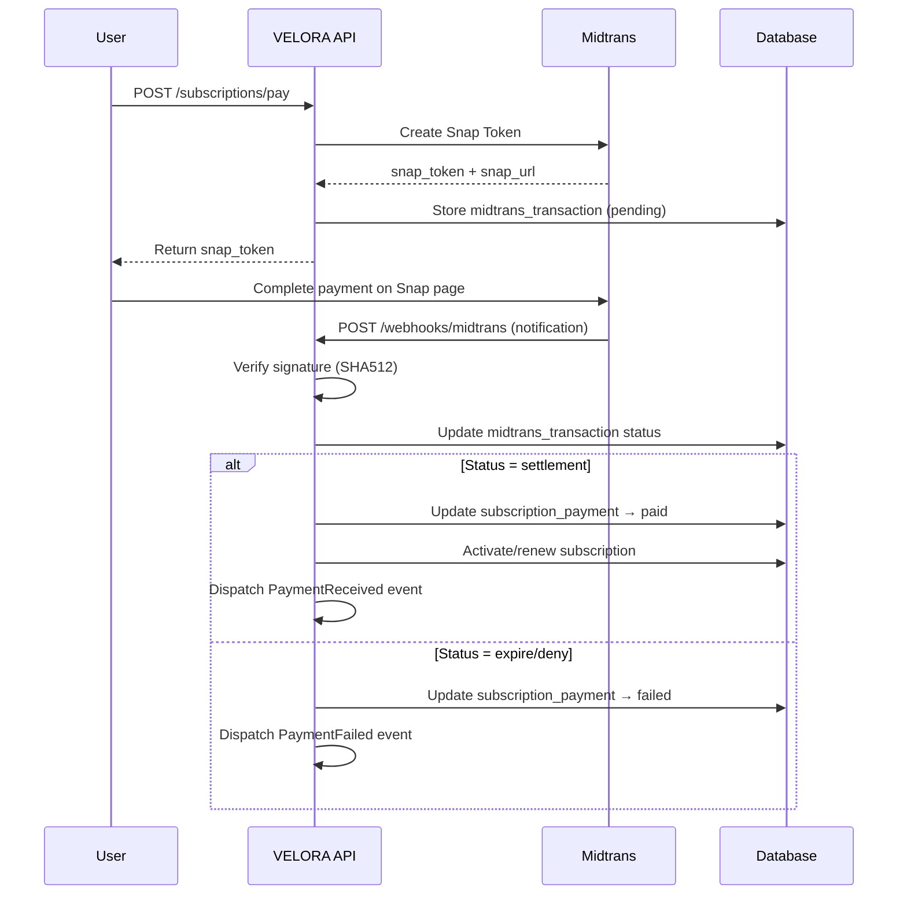

# VELORA — Database Architecture Addendum

> Multi-Currency, Midtrans Payment, Dual Billing, AI Tables

---

## Multi-Currency Support

### `currencies`
| Column | Type | Constraints | Description |
|--------|------|-------------|-------------|
| id | CHAR(36) | PK | |
| code | VARCHAR(5) | UNIQUE, NOT NULL | ISO 4217: IDR, USD, SGD, MYR |
| name | VARCHAR(50) | NOT NULL | "Indonesian Rupiah" |
| symbol | VARCHAR(5) | NOT NULL | "Rp", "$", "RM" |
| decimal_places | TINYINT | DEFAULT 0 | IDR=0, USD=2 |
| thousand_separator | VARCHAR(1) | DEFAULT '.' | |
| decimal_separator | VARCHAR(1) | DEFAULT ',' | |
| symbol_position | VARCHAR(10) | DEFAULT 'before' | before or after |
| is_default | TINYINT(1) | DEFAULT 0 | Only 1 default (IDR) |
| is_active | TINYINT(1) | DEFAULT 1 | |
| created_at | TIMESTAMP | | |
| updated_at | TIMESTAMP | | |

**Seeded defaults**: IDR (default), USD, SGD, MYR, EUR

### `exchange_rates`
| Column | Type | Constraints | Description |
|--------|------|-------------|-------------|
| id | CHAR(36) | PK | |
| from_currency | VARCHAR(5) | NOT NULL | e.g., "USD" |
| to_currency | VARCHAR(5) | NOT NULL | e.g., "IDR" |
| rate | DECIMAL(18,6) | NOT NULL | 1 USD = 16,250.000000 IDR |
| source | VARCHAR(30) | DEFAULT 'manual' | manual, api, bank_indonesia |
| effective_date | DATE | NOT NULL | |
| created_at | TIMESTAMP | | |

**Indexes**: `UNIQUE(from_currency, to_currency, effective_date)`

### How Multi-Currency Works
```
1. Each business has a `currency` field (default: IDR)
2. All money in DB stored in the business's primary currency
3. For multi-currency display:
   - Frontend requests data → API returns in primary currency
   - Frontend can convert using exchange_rates for display
4. Transactions always recorded in business currency
5. Exchange rates updated daily (scheduler or manual)
```

---

## Midtrans Payment Integration

### `midtrans_transactions`
| Column | Type | Constraints | Description |
|--------|------|-------------|-------------|
| id | CHAR(36) | PK | |
| business_id | CHAR(36) | FK→businesses | |
| payable_type | VARCHAR(100) | NOT NULL | subscription_payment, transaction |
| payable_id | CHAR(36) | NOT NULL | FK to source record |
| order_id | VARCHAR(50) | UNIQUE, NOT NULL | Midtrans order ID |
| snap_token | VARCHAR(100) | NULLABLE | Snap checkout token |
| snap_url | VARCHAR(500) | NULLABLE | Snap redirect URL |
| payment_type | VARCHAR(30) | NULLABLE | bank_transfer, gopay, qris, credit_card, etc. |
| gross_amount | BIGINT UNSIGNED | NOT NULL | |
| currency | VARCHAR(5) | DEFAULT 'IDR' | |
| va_number | VARCHAR(50) | NULLABLE | Virtual account number |
| bank | VARCHAR(20) | NULLABLE | BCA, BNI, BRI, Mandiri, etc. |
| transaction_id | VARCHAR(100) | NULLABLE | Midtrans transaction ID |
| transaction_status | VARCHAR(30) | DEFAULT 'pending' | pending, capture, settlement, deny, cancel, expire, refund |
| fraud_status | VARCHAR(20) | NULLABLE | accept, deny, challenge |
| status_code | VARCHAR(5) | NULLABLE | HTTP status from Midtrans |
| settlement_time | TIMESTAMP | NULLABLE | When payment settled |
| expiry_time | TIMESTAMP | NULLABLE | Payment expiry |
| metadata | JSON | NULLABLE | Full Midtrans response |
| created_at | TIMESTAMP | | |
| updated_at | TIMESTAMP | | |

**Indexes**: `(order_id)`, `(payable_type, payable_id)`, `(business_id, transaction_status)`

### Midtrans Webhook Flow



---

## Dual Billing System

### How It Works

```
Business owner chooses billing mode at subscription:

┌─────────────────────────────────────────────────────┐
│ Pilih Metode Pembayaran                              │
│                                                       │
│ ┌─────────────────┐  ┌─────────────────┐             │
│ │ 💳 Auto-Charge  │  │ 🏦 Transfer     │             │
│ │                 │  │    Manual        │             │
│ │ Bayar otomatis  │  │                  │             │
│ │ via Midtrans    │  │ Transfer bank    │             │
│ │ (QRIS, e-wallet,│  │ lalu upload      │             │
│ │  VA, kartu)     │  │ bukti transfer   │             │
│ └─────────────────┘  └─────────────────┘             │
└─────────────────────────────────────────────────────┘
```

### Mode 1: Auto-Charge (Midtrans)
```
1. User clicks "Subscribe" → API creates subscription_payment (pending)
2. API calls Midtrans Snap → returns snap_token
3. User completes payment on Midtrans popup
4. Midtrans webhook → confirms payment
5. System auto-activates subscription
6. Next billing: system auto-creates new payment + Snap token
```

### Mode 2: Manual Transfer
```
1. User clicks "Subscribe" → API creates subscription_payment (pending)
2. System shows bank account details (Velora's bank)
3. User transfers manually
4. User uploads proof of transfer (receipt image)
5. Platform admin verifies payment
6. Admin clicks "Verify" → system activates subscription
```

### `manual_payments` (for manual transfer tracking)
| Column | Type | Constraints | Description |
|--------|------|-------------|-------------|
| id | CHAR(36) | PK | |
| subscription_payment_id | CHAR(36) | FK→subscription_payments | |
| bank_name | VARCHAR(50) | NOT NULL | Sender's bank |
| account_name | VARCHAR(100) | NOT NULL | Sender's name |
| account_number | VARCHAR(50) | NOT NULL | Sender's account |
| transfer_amount | BIGINT UNSIGNED | NOT NULL | Amount transferred |
| transfer_date | DATE | NOT NULL | |
| proof_image_url | VARCHAR(500) | NOT NULL | Upload receipt |
| status | VARCHAR(20) | DEFAULT 'pending' | Enum: pending, verified, rejected |
| verified_by | CHAR(36) | NULLABLE, FK→users | Platform admin |
| verified_at | TIMESTAMP | NULLABLE | |
| rejected_reason | TEXT | NULLABLE | |
| created_at | TIMESTAMP | | |
| updated_at | TIMESTAMP | | |

### Update to `subscription_payments` (add billing_mode)

Add column to existing `subscription_payments` table:
```
billing_mode   VARCHAR(20)  DEFAULT 'auto'    Enum: auto, manual
```

### Update to `subscriptions` (add preferred billing)

Add column to existing `subscriptions` table:
```
billing_mode   VARCHAR(20)  DEFAULT 'auto'    Enum: auto, manual
```

---

## AI Module Tables

> Full table definitions in [AI Architecture](file:///C:/Users/YP/.gemini/antigravity/brain/7880df49-c88e-4c8f-82bc-eb5a42cebb61/ai_architecture.md#3-database-tables-ai-module)

| Table | Purpose |
|-------|---------|
| `ai_queries` | Stores every AI interaction (query + response + cost) |
| `forecasts` | Sales predictions per product/category |
| `anomalies` | Detected unusual patterns |
| `ai_usage_logs` | Monthly AI usage aggregation per business |

---

## Updated Master Table Count

| Module | Tables | Delta |
|--------|--------|-------|
| Tenant (Core) | 5 | — |
| Subscription | 5 + 1 (manual_payments) + 1 (midtrans_transactions) = **7** | +2 |
| Auth/Security | 5 | — |
| POS | 8 | — |
| Inventory | 10 | — |
| Sales | 9 | — |
| Purchasing | 5 | — |
| CRM | 7 | — |
| Finance | 7 | — |
| Settings | 2 + 2 (currencies, exchange_rates) = **4** | +2 |
| AI | **4** | +4 |
| **TOTAL** | **~71** | +8 |

---

*Back to [Master Plan](file:///C:/Users/YP/.gemini/antigravity/brain/7880df49-c88e-4c8f-82bc-eb5a42cebb61/implementation_plan.md)*
