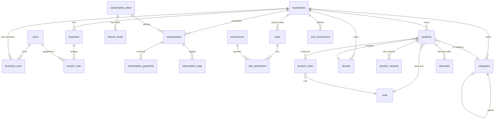

# VELORA — Database Architecture Part 1: Core, Auth, Subscription, POS

> All PKs are UUID v7. All tenant-scoped tables have `business_id`. Money = `BIGINT` (smallest unit).

---

## Global Conventions

| Convention | Rule |
|---|---|
| Primary Key | `id` UUID v7, `CHAR(36)` |
| Foreign Key | `{table_singular}_id` CHAR(36) |
| Timestamps | `created_at`, `updated_at` (TIMESTAMP) |
| Soft Delete | `deleted_at` TIMESTAMP NULL where needed |
| Money | `BIGINT UNSIGNED` — store in smallest unit (IDR = no decimal, store as integer) |
| Boolean | `TINYINT(1)` with `is_` or `has_` prefix |
| Enum | Laravel PHP Enum backed by `VARCHAR` |
| Index | Every FK indexed. Composite index on `(business_id, ...)` for tenant queries |

---

## Module: Tenant (Core SaaS)

### `users`
| Column | Type | Constraints | Description |
|--------|------|-------------|-------------|
| id | CHAR(36) | PK | UUID v7 |
| name | VARCHAR(100) | NOT NULL | Full name |
| email | VARCHAR(150) | UNIQUE, NOT NULL | Login email |
| phone | VARCHAR(20) | NULLABLE, INDEX | Phone number |
| password | VARCHAR(255) | NOT NULL | Hashed |
| avatar_url | VARCHAR(500) | NULLABLE | Profile picture |
| email_verified_at | TIMESTAMP | NULLABLE | Email verification |
| is_platform_admin | TINYINT(1) | DEFAULT 0 | Super admin flag |
| last_login_at | TIMESTAMP | NULLABLE | Last login tracking |
| last_login_ip | VARCHAR(45) | NULLABLE | IPv4/IPv6 |
| status | VARCHAR(20) | DEFAULT 'active' | Enum: active, suspended, banned |
| created_at | TIMESTAMP | | |
| updated_at | TIMESTAMP | | |
| deleted_at | TIMESTAMP | NULLABLE | Soft delete |

### `businesses`
| Column | Type | Constraints | Description |
|--------|------|-------------|-------------|
| id | CHAR(36) | PK | |
| owner_id | CHAR(36) | FK→users, NOT NULL | Business owner |
| name | VARCHAR(150) | NOT NULL | Business name |
| slug | VARCHAR(150) | UNIQUE, NOT NULL | URL-friendly identifier |
| legal_name | VARCHAR(200) | NULLABLE | Legal entity name |
| tax_id | VARCHAR(50) | NULLABLE | NPWP |
| business_type | VARCHAR(30) | NOT NULL | Enum: retail, fnb, service, wholesale |
| industry | VARCHAR(50) | NULLABLE | e.g., "Food & Beverage" |
| phone | VARCHAR(20) | NULLABLE | |
| email | VARCHAR(150) | NULLABLE | |
| website | VARCHAR(255) | NULLABLE | |
| logo_url | VARCHAR(500) | NULLABLE | |
| address | TEXT | NULLABLE | |
| city | VARCHAR(100) | NULLABLE | |
| province | VARCHAR(100) | NULLABLE | |
| postal_code | VARCHAR(10) | NULLABLE | |
| country | VARCHAR(5) | DEFAULT 'ID' | ISO country code |
| currency | VARCHAR(5) | DEFAULT 'IDR' | Primary currency |
| timezone | VARCHAR(50) | DEFAULT 'Asia/Jakarta' | |
| status | VARCHAR(20) | DEFAULT 'active' | Enum: active, suspended, locked |
| locked_at | TIMESTAMP | NULLABLE | When subscription locks |
| locked_reason | VARCHAR(100) | NULLABLE | |
| settings | JSON | NULLABLE | Business-level settings |
| created_at | TIMESTAMP | | |
| updated_at | TIMESTAMP | | |
| deleted_at | TIMESTAMP | NULLABLE | |

**Indexes**: `(owner_id)`, `(slug)`, `(status)`

### `branches`
| Column | Type | Constraints | Description |
|--------|------|-------------|-------------|
| id | CHAR(36) | PK | |
| business_id | CHAR(36) | FK→businesses, NOT NULL | |
| name | VARCHAR(100) | NOT NULL | Branch name |
| code | VARCHAR(20) | NOT NULL | Short code e.g., "HQ", "CB-01" |
| type | VARCHAR(20) | DEFAULT 'store' | Enum: store, warehouse, hybrid |
| phone | VARCHAR(20) | NULLABLE | |
| email | VARCHAR(150) | NULLABLE | |
| address | TEXT | NULLABLE | |
| city | VARCHAR(100) | NULLABLE | |
| province | VARCHAR(100) | NULLABLE | |
| postal_code | VARCHAR(10) | NULLABLE | |
| latitude | DECIMAL(10,7) | NULLABLE | |
| longitude | DECIMAL(10,7) | NULLABLE | |
| is_main | TINYINT(1) | DEFAULT 0 | Main/HQ branch |
| is_active | TINYINT(1) | DEFAULT 1 | |
| settings | JSON | NULLABLE | Branch-level settings |
| created_at | TIMESTAMP | | |
| updated_at | TIMESTAMP | | |
| deleted_at | TIMESTAMP | NULLABLE | |

**Indexes**: `(business_id, is_active)`, `UNIQUE(business_id, code)`

### `business_user` (Pivot)
| Column | Type | Constraints | Description |
|--------|------|-------------|-------------|
| id | CHAR(36) | PK | |
| business_id | CHAR(36) | FK→businesses | |
| user_id | CHAR(36) | FK→users | |
| role_id | CHAR(36) | FK→roles | Primary role |
| is_owner | TINYINT(1) | DEFAULT 0 | |
| joined_at | TIMESTAMP | NOT NULL | |
| status | VARCHAR(20) | DEFAULT 'active' | Enum: active, invited, suspended |
| created_at | TIMESTAMP | | |
| updated_at | TIMESTAMP | | |

**Indexes**: `UNIQUE(business_id, user_id)`

### `branch_user` (Pivot)
| Column | Type | Constraints | Description |
|--------|------|-------------|-------------|
| id | CHAR(36) | PK | |
| branch_id | CHAR(36) | FK→branches | |
| user_id | CHAR(36) | FK→users | |
| is_default | TINYINT(1) | DEFAULT 0 | Default branch for user |
| created_at | TIMESTAMP | | |
| updated_at | TIMESTAMP | | |

**Indexes**: `UNIQUE(branch_id, user_id)`

---

## Module: Subscription

### `subscription_plans`
| Column | Type | Constraints | Description |
|--------|------|-------------|-------------|
| id | CHAR(36) | PK | |
| name | VARCHAR(100) | NOT NULL | e.g., "Starter", "Pro", "Enterprise" |
| slug | VARCHAR(100) | UNIQUE, NOT NULL | |
| description | TEXT | NULLABLE | |
| price_monthly | BIGINT UNSIGNED | DEFAULT 0 | Monthly price |
| price_quarterly | BIGINT UNSIGNED | DEFAULT 0 | 3-month price |
| price_biannual | BIGINT UNSIGNED | DEFAULT 0 | 6-month price |
| price_annual | BIGINT UNSIGNED | DEFAULT 0 | Yearly price |
| trial_days | INT UNSIGNED | DEFAULT 0 | Free trial period |
| grace_period_days | INT UNSIGNED | DEFAULT 3 | Days after expiry before lock |
| is_active | TINYINT(1) | DEFAULT 1 | |
| is_featured | TINYINT(1) | DEFAULT 0 | Highlighted plan |
| sort_order | INT | DEFAULT 0 | Display order |
| metadata | JSON | NULLABLE | Extra plan data |
| created_at | TIMESTAMP | | |
| updated_at | TIMESTAMP | | |

### `feature_limits`
| Column | Type | Constraints | Description |
|--------|------|-------------|-------------|
| id | CHAR(36) | PK | |
| plan_id | CHAR(36) | FK→subscription_plans | |
| feature_key | VARCHAR(50) | NOT NULL | e.g., "max_products", "max_branches", "max_users" |
| feature_value | VARCHAR(50) | NOT NULL | Number or "unlimited" |
| created_at | TIMESTAMP | | |
| updated_at | TIMESTAMP | | |

**Indexes**: `UNIQUE(plan_id, feature_key)`

**Feature keys include**: `max_products`, `max_branches`, `max_users`, `max_warehouses`, `max_transactions_per_month`, `enable_multi_warehouse`, `enable_batch_tracking`, `enable_loyalty`, `enable_api_access`, `enable_advanced_reports`

### `subscriptions`
| Column | Type | Constraints | Description |
|--------|------|-------------|-------------|
| id | CHAR(36) | PK | |
| business_id | CHAR(36) | FK→businesses, NOT NULL | |
| plan_id | CHAR(36) | FK→subscription_plans | |
| billing_cycle | VARCHAR(20) | NOT NULL | Enum: monthly, quarterly, biannual, annual |
| status | VARCHAR(20) | NOT NULL | Enum: trial, active, past_due, grace, expired, cancelled |
| trial_starts_at | TIMESTAMP | NULLABLE | |
| trial_ends_at | TIMESTAMP | NULLABLE | |
| starts_at | TIMESTAMP | NOT NULL | |
| ends_at | TIMESTAMP | NOT NULL | |
| grace_ends_at | TIMESTAMP | NULLABLE | Grace period end |
| cancelled_at | TIMESTAMP | NULLABLE | |
| cancel_reason | TEXT | NULLABLE | |
| auto_renew | TINYINT(1) | DEFAULT 1 | |
| created_at | TIMESTAMP | | |
| updated_at | TIMESTAMP | | |

**Indexes**: `(business_id, status)`, `(ends_at)`

### `subscription_payments`
| Column | Type | Constraints | Description |
|--------|------|-------------|-------------|
| id | CHAR(36) | PK | |
| business_id | CHAR(36) | FK→businesses | |
| subscription_id | CHAR(36) | FK→subscriptions | |
| invoice_number | VARCHAR(50) | UNIQUE, NOT NULL | e.g., "INV-2026-00001" |
| amount | BIGINT UNSIGNED | NOT NULL | Total amount |
| discount_amount | BIGINT UNSIGNED | DEFAULT 0 | |
| tax_amount | BIGINT UNSIGNED | DEFAULT 0 | |
| total_amount | BIGINT UNSIGNED | NOT NULL | Final amount |
| payment_method | VARCHAR(30) | NULLABLE | bank_transfer, ewallet, etc. |
| payment_gateway | VARCHAR(30) | NULLABLE | midtrans, xendit |
| gateway_transaction_id | VARCHAR(100) | NULLABLE | External ref |
| status | VARCHAR(20) | NOT NULL | Enum: pending, paid, failed, refunded, expired |
| paid_at | TIMESTAMP | NULLABLE | |
| due_at | TIMESTAMP | NOT NULL | |
| notes | TEXT | NULLABLE | |
| metadata | JSON | NULLABLE | Gateway response data |
| created_at | TIMESTAMP | | |
| updated_at | TIMESTAMP | | |

### `subscription_logs`
| Column | Type | Constraints | Description |
|--------|------|-------------|-------------|
| id | CHAR(36) | PK | |
| business_id | CHAR(36) | FK→businesses | |
| subscription_id | CHAR(36) | FK→subscriptions | |
| action | VARCHAR(30) | NOT NULL | Enum: created, renewed, upgraded, downgraded, cancelled, expired, locked, unlocked |
| from_plan_id | CHAR(36) | NULLABLE | Previous plan |
| to_plan_id | CHAR(36) | NULLABLE | New plan |
| note | TEXT | NULLABLE | |
| performed_by | CHAR(36) | NULLABLE | FK→users |
| created_at | TIMESTAMP | | |

---

## Module: Auth / Security

### `roles`
| Column | Type | Constraints | Description |
|--------|------|-------------|-------------|
| id | CHAR(36) | PK | |
| business_id | CHAR(36) | NULLABLE | NULL = system role, else tenant role |
| name | VARCHAR(50) | NOT NULL | e.g., "owner", "admin", "cashier" |
| slug | VARCHAR(50) | NOT NULL | |
| display_name | VARCHAR(100) | NULLABLE | |
| description | VARCHAR(255) | NULLABLE | |
| is_system | TINYINT(1) | DEFAULT 0 | System-defined, cannot delete |
| level | INT UNSIGNED | DEFAULT 0 | Hierarchy: 0=highest |
| created_at | TIMESTAMP | | |
| updated_at | TIMESTAMP | | |

**Indexes**: `UNIQUE(business_id, slug)`

**System roles**: `platform_admin`, `owner`, `admin`, `manager`, `cashier`, `warehouse_staff`

### `permissions`
| Column | Type | Constraints | Description |
|--------|------|-------------|-------------|
| id | CHAR(36) | PK | |
| module | VARCHAR(30) | NOT NULL | e.g., "pos", "inventory", "finance" |
| name | VARCHAR(80) | UNIQUE, NOT NULL | e.g., "products.create" |
| display_name | VARCHAR(150) | NULLABLE | |
| description | VARCHAR(255) | NULLABLE | |
| created_at | TIMESTAMP | | |
| updated_at | TIMESTAMP | | |

### `role_permission` (Pivot)
| Column | Type | Constraints | Description |
|--------|------|-------------|-------------|
| role_id | CHAR(36) | FK→roles | |
| permission_id | CHAR(36) | FK→permissions | |

**Index**: `PRIMARY(role_id, permission_id)`

### `activity_logs`
| Column | Type | Constraints | Description |
|--------|------|-------------|-------------|
| id | CHAR(36) | PK | |
| business_id | CHAR(36) | NULLABLE, INDEX | |
| user_id | CHAR(36) | NULLABLE, FK→users | |
| action | VARCHAR(50) | NOT NULL | login, logout, create, update, delete |
| module | VARCHAR(30) | NULLABLE | Which module |
| description | VARCHAR(500) | NULLABLE | Human-readable |
| ip_address | VARCHAR(45) | NULLABLE | |
| user_agent | VARCHAR(500) | NULLABLE | |
| created_at | TIMESTAMP | | |

**Indexes**: `(business_id, created_at)`, `(user_id, created_at)`

### `audit_logs`
| Column | Type | Constraints | Description |
|--------|------|-------------|-------------|
| id | CHAR(36) | PK | |
| business_id | CHAR(36) | INDEX | |
| user_id | CHAR(36) | NULLABLE | |
| auditable_type | VARCHAR(150) | NOT NULL | Model class |
| auditable_id | CHAR(36) | NOT NULL | Model ID |
| event | VARCHAR(20) | NOT NULL | created, updated, deleted, restored |
| old_values | JSON | NULLABLE | Before state |
| new_values | JSON | NULLABLE | After state |
| url | VARCHAR(500) | NULLABLE | |
| ip_address | VARCHAR(45) | NULLABLE | |
| created_at | TIMESTAMP | | |

**Indexes**: `(auditable_type, auditable_id)`, `(business_id, created_at)`

---

## Module: POS (Products)

### `categories`
| Column | Type | Constraints | Description |
|--------|------|-------------|-------------|
| id | CHAR(36) | PK | |
| business_id | CHAR(36) | FK→businesses | |
| parent_id | CHAR(36) | NULLABLE, FK→categories | Nested categories |
| name | VARCHAR(100) | NOT NULL | |
| slug | VARCHAR(100) | NOT NULL | |
| description | TEXT | NULLABLE | |
| image_url | VARCHAR(500) | NULLABLE | |
| sort_order | INT | DEFAULT 0 | |
| is_active | TINYINT(1) | DEFAULT 1 | |
| created_at | TIMESTAMP | | |
| updated_at | TIMESTAMP | | |
| deleted_at | TIMESTAMP | NULLABLE | |

**Indexes**: `(business_id, is_active)`, `UNIQUE(business_id, slug)`, `(parent_id)`

### `brands`
| Column | Type | Constraints | Description |
|--------|------|-------------|-------------|
| id | CHAR(36) | PK | |
| business_id | CHAR(36) | FK→businesses | |
| name | VARCHAR(100) | NOT NULL | |
| slug | VARCHAR(100) | NOT NULL | |
| logo_url | VARCHAR(500) | NULLABLE | |
| is_active | TINYINT(1) | DEFAULT 1 | |
| created_at | TIMESTAMP | | |
| updated_at | TIMESTAMP | | |
| deleted_at | TIMESTAMP | NULLABLE | |

**Indexes**: `UNIQUE(business_id, slug)`

### `units`
| Column | Type | Constraints | Description |
|--------|------|-------------|-------------|
| id | CHAR(36) | PK | |
| business_id | CHAR(36) | NULLABLE | NULL = system unit |
| name | VARCHAR(50) | NOT NULL | e.g., "Kilogram" |
| abbreviation | VARCHAR(10) | NOT NULL | e.g., "kg" |
| group | VARCHAR(30) | NOT NULL | Enum: weight, volume, length, quantity, custom |
| is_system | TINYINT(1) | DEFAULT 0 | System-defined |
| created_at | TIMESTAMP | | |
| updated_at | TIMESTAMP | | |

**System units seeded**: pcs, pack, box, dus, karton, lusin, kg, gram, mg, liter, ml, meter, cm, botol, galon, lembar, batang

### `unit_conversions`
| Column | Type | Constraints | Description |
|--------|------|-------------|-------------|
| id | CHAR(36) | PK | |
| business_id | CHAR(36) | FK→businesses | |
| from_unit_id | CHAR(36) | FK→units | |
| to_unit_id | CHAR(36) | FK→units | |
| conversion_factor | DECIMAL(15,6) | NOT NULL | 1 from_unit = X to_unit |
| created_at | TIMESTAMP | | |
| updated_at | TIMESTAMP | | |

**Indexes**: `UNIQUE(business_id, from_unit_id, to_unit_id)`

**Example**: from=dus, to=pcs, factor=24 → 1 dus = 24 pcs

### `products`
| Column | Type | Constraints | Description |
|--------|------|-------------|-------------|
| id | CHAR(36) | PK | |
| business_id | CHAR(36) | FK→businesses | |
| category_id | CHAR(36) | NULLABLE, FK→categories | |
| brand_id | CHAR(36) | NULLABLE, FK→brands | |
| name | VARCHAR(200) | NOT NULL | |
| slug | VARCHAR(200) | NOT NULL | |
| sku | VARCHAR(50) | NULLABLE | Stock Keeping Unit |
| barcode | VARCHAR(50) | NULLABLE | Primary barcode |
| description | TEXT | NULLABLE | |
| base_unit_id | CHAR(36) | FK→units | Smallest unit for this product |
| purchase_price | BIGINT UNSIGNED | DEFAULT 0 | Default buy price (in base unit) |
| selling_price | BIGINT UNSIGNED | DEFAULT 0 | Default sell price (in base unit) |
| minimum_price | BIGINT UNSIGNED | DEFAULT 0 | Floor price (for discounts) |
| product_type | VARCHAR(20) | DEFAULT 'standard' | Enum: standard, variant, service, bundle |
| tax_type | VARCHAR(20) | DEFAULT 'taxable' | Enum: taxable, non_taxable, inclusive |
| is_active | TINYINT(1) | DEFAULT 1 | |
| is_track_stock | TINYINT(1) | DEFAULT 1 | Enable stock tracking |
| is_track_batch | TINYINT(1) | DEFAULT 0 | Enable batch/lot tracking |
| is_track_expiry | TINYINT(1) | DEFAULT 0 | Enable expiry tracking |
| has_variants | TINYINT(1) | DEFAULT 0 | Has size/color variants |
| min_stock | INT | DEFAULT 0 | Minimum stock alert |
| max_stock | INT | NULLABLE | Maximum stock |
| weight | DECIMAL(10,3) | NULLABLE | For shipping (grams) |
| image_url | VARCHAR(500) | NULLABLE | Primary image |
| images | JSON | NULLABLE | Array of image URLs |
| sort_order | INT | DEFAULT 0 | |
| created_at | TIMESTAMP | | |
| updated_at | TIMESTAMP | | |
| deleted_at | TIMESTAMP | NULLABLE | |

**Indexes**: `(business_id, is_active)`, `(business_id, category_id)`, `(business_id, sku)`, `(business_id, barcode)`, `FULLTEXT(name, sku, barcode)`

### `product_variants`
| Column | Type | Constraints | Description |
|--------|------|-------------|-------------|
| id | CHAR(36) | PK | |
| product_id | CHAR(36) | FK→products | |
| business_id | CHAR(36) | FK→businesses | |
| name | VARCHAR(100) | NOT NULL | e.g., "Large - Red" |
| sku | VARCHAR(50) | NULLABLE | Variant SKU |
| barcode | VARCHAR(50) | NULLABLE | |
| purchase_price | BIGINT UNSIGNED | DEFAULT 0 | Override parent |
| selling_price | BIGINT UNSIGNED | DEFAULT 0 | |
| min_stock | INT | DEFAULT 0 | |
| image_url | VARCHAR(500) | NULLABLE | |
| option_values | JSON | NOT NULL | {"size":"Large","color":"Red"} |
| is_active | TINYINT(1) | DEFAULT 1 | |
| sort_order | INT | DEFAULT 0 | |
| created_at | TIMESTAMP | | |
| updated_at | TIMESTAMP | | |
| deleted_at | TIMESTAMP | NULLABLE | |

**Indexes**: `(product_id)`, `(business_id, sku)`, `(business_id, barcode)`

### `product_units` (Multi-unit pricing per product)
| Column | Type | Constraints | Description |
|--------|------|-------------|-------------|
| id | CHAR(36) | PK | |
| product_id | CHAR(36) | FK→products | |
| unit_id | CHAR(36) | FK→units | |
| conversion_to_base | DECIMAL(15,6) | NOT NULL | 1 this unit = X base units |
| purchase_price | BIGINT UNSIGNED | DEFAULT 0 | Buy price in this unit |
| selling_price | BIGINT UNSIGNED | DEFAULT 0 | Sell price in this unit |
| barcode | VARCHAR(50) | NULLABLE | Barcode for this unit |
| is_purchase_unit | TINYINT(1) | DEFAULT 0 | Used for purchasing |
| is_sale_unit | TINYINT(1) | DEFAULT 1 | Used for selling |
| is_default | TINYINT(1) | DEFAULT 0 | Default display unit |
| created_at | TIMESTAMP | | |
| updated_at | TIMESTAMP | | |

**Indexes**: `UNIQUE(product_id, unit_id)`

**Example**: Product "Aqua 600ml"  
- base_unit = pcs  
- product_units: {unit=dus, conversion=24, sell_price=60000}, {unit=karton, conversion=48, sell_price=115000}

### `barcodes` (Additional barcodes per product)
| Column | Type | Constraints | Description |
|--------|------|-------------|-------------|
| id | CHAR(36) | PK | |
| business_id | CHAR(36) | FK→businesses | |
| barcodeable_type | VARCHAR(150) | NOT NULL | product or product_variant |
| barcodeable_id | CHAR(36) | NOT NULL | |
| code | VARCHAR(100) | NOT NULL | Barcode value |
| type | VARCHAR(20) | DEFAULT 'ean13' | Enum: ean13, ean8, upc, code128, qr, custom |
| unit_id | CHAR(36) | NULLABLE, FK→units | Barcode for specific unit |
| is_primary | TINYINT(1) | DEFAULT 0 | |
| created_at | TIMESTAMP | | |
| updated_at | TIMESTAMP | | |

**Indexes**: `(business_id, code)`, `(barcodeable_type, barcodeable_id)`

---

## Relationship Diagram — Core + POS

---

*Continued in [Part 2 — Inventory, Sales, Purchasing](file:///C:/Users/YP/.gemini/antigravity/brain/7880df49-c88e-4c8f-82bc-eb5a42cebb61/database_architecture_part2.md)*  
*Continued in [Part 3 — CRM, Finance, Settings](file:///C:/Users/YP/.gemini/antigravity/brain/7880df49-c88e-4c8f-82bc-eb5a42cebb61/database_architecture_part3.md)*
