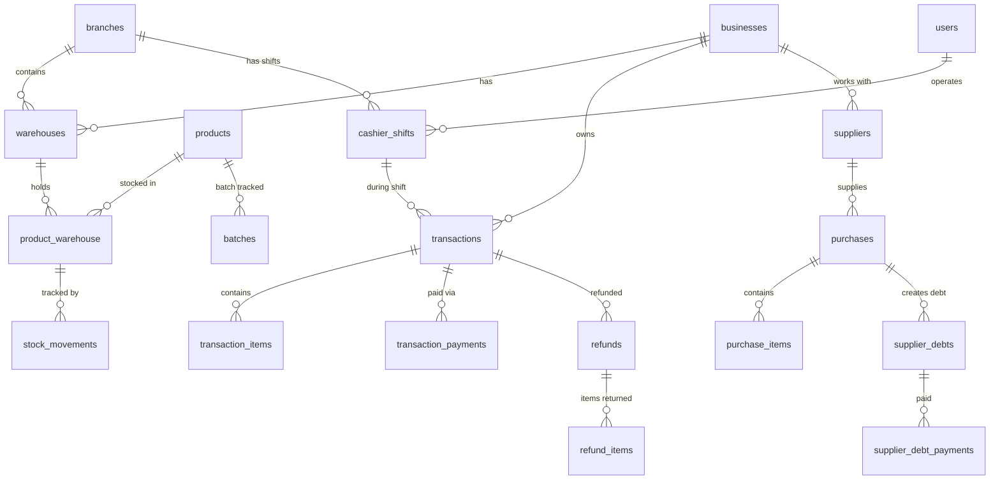

# VELORA — Database Architecture Part 2: Inventory, Sales, Purchasing

---

## Module: Inventory

### `warehouses`
| Column | Type | Constraints | Description |
|--------|------|-------------|-------------|
| id | CHAR(36) | PK | |
| business_id | CHAR(36) | FK→businesses | |
| branch_id | CHAR(36) | FK→branches | Linked branch |
| name | VARCHAR(100) | NOT NULL | e.g., "Gudang Utama" |
| code | VARCHAR(20) | NOT NULL | |
| type | VARCHAR(20) | DEFAULT 'main' | Enum: main, transit, defect, consignment |
| address | TEXT | NULLABLE | |
| is_active | TINYINT(1) | DEFAULT 1 | |
| is_default | TINYINT(1) | DEFAULT 0 | Default warehouse for branch |
| created_at | TIMESTAMP | | |
| updated_at | TIMESTAMP | | |
| deleted_at | TIMESTAMP | NULLABLE | |

**Indexes**: `UNIQUE(business_id, code)`, `(branch_id)`

### `product_warehouse` (Current Stock per Location)
| Column | Type | Constraints | Description |
|--------|------|-------------|-------------|
| id | CHAR(36) | PK | |
| product_id | CHAR(36) | FK→products | |
| product_variant_id | CHAR(36) | NULLABLE, FK→product_variants | |
| warehouse_id | CHAR(36) | FK→warehouses | |
| business_id | CHAR(36) | FK→businesses | Denormalized for query speed |
| quantity | DECIMAL(15,4) | DEFAULT 0 | Current stock in base unit |
| reserved_quantity | DECIMAL(15,4) | DEFAULT 0 | Reserved (pending orders) |
| available_quantity | DECIMAL(15,4) | GENERATED | quantity - reserved_quantity |
| cost_price_avg | BIGINT UNSIGNED | DEFAULT 0 | Weighted average cost |
| last_restock_at | TIMESTAMP | NULLABLE | |
| created_at | TIMESTAMP | | |
| updated_at | TIMESTAMP | | |

**Indexes**: `UNIQUE(product_id, product_variant_id, warehouse_id)`, `(business_id, warehouse_id)`

### `stock_movements`
| Column | Type | Constraints | Description |
|--------|------|-------------|-------------|
| id | CHAR(36) | PK | |
| business_id | CHAR(36) | FK→businesses | |
| product_id | CHAR(36) | FK→products | |
| product_variant_id | CHAR(36) | NULLABLE | |
| warehouse_id | CHAR(36) | FK→warehouses | |
| batch_id | CHAR(36) | NULLABLE, FK→batches | |
| reference_type | VARCHAR(100) | NOT NULL | Source model: transaction, purchase, adjustment, transfer, opname |
| reference_id | CHAR(36) | NOT NULL | Source model ID |
| movement_type | VARCHAR(20) | NOT NULL | Enum: in, out, transfer_in, transfer_out, adjustment, opname |
| quantity | DECIMAL(15,4) | NOT NULL | Positive for in, negative for out |
| unit_id | CHAR(36) | FK→units | Unit used in this movement |
| base_quantity | DECIMAL(15,4) | NOT NULL | Converted to base unit |
| cost_price | BIGINT UNSIGNED | DEFAULT 0 | Cost per base unit at time |
| stock_before | DECIMAL(15,4) | NOT NULL | Stock before this movement |
| stock_after | DECIMAL(15,4) | NOT NULL | Stock after this movement |
| note | TEXT | NULLABLE | |
| performed_by | CHAR(36) | NULLABLE, FK→users | |
| created_at | TIMESTAMP | | |

**Indexes**: `(business_id, product_id, created_at)`, `(reference_type, reference_id)`, `(warehouse_id, created_at)`

> [!NOTE]
> `stock_movements` is **append-only** (insert-only). Never update or delete. This is the immutable ledger of all stock changes.

### `stock_transfers`
| Column | Type | Constraints | Description |
|--------|------|-------------|-------------|
| id | CHAR(36) | PK | |
| business_id | CHAR(36) | FK→businesses | |
| transfer_number | VARCHAR(50) | UNIQUE | e.g., "TRF-20260518-001" |
| from_warehouse_id | CHAR(36) | FK→warehouses | |
| to_warehouse_id | CHAR(36) | FK→warehouses | |
| status | VARCHAR(20) | DEFAULT 'draft' | Enum: draft, in_transit, received, cancelled |
| note | TEXT | NULLABLE | |
| transferred_by | CHAR(36) | FK→users | |
| received_by | CHAR(36) | NULLABLE, FK→users | |
| transferred_at | TIMESTAMP | NULLABLE | |
| received_at | TIMESTAMP | NULLABLE | |
| created_at | TIMESTAMP | | |
| updated_at | TIMESTAMP | | |

### `stock_transfer_items`
| Column | Type | Constraints | Description |
|--------|------|-------------|-------------|
| id | CHAR(36) | PK | |
| stock_transfer_id | CHAR(36) | FK→stock_transfers | |
| product_id | CHAR(36) | FK→products | |
| product_variant_id | CHAR(36) | NULLABLE | |
| quantity_sent | DECIMAL(15,4) | NOT NULL | |
| quantity_received | DECIMAL(15,4) | DEFAULT 0 | May differ |
| unit_id | CHAR(36) | FK→units | |
| base_quantity_sent | DECIMAL(15,4) | NOT NULL | |
| note | TEXT | NULLABLE | |
| created_at | TIMESTAMP | | |

### `stock_opnames`
| Column | Type | Constraints | Description |
|--------|------|-------------|-------------|
| id | CHAR(36) | PK | |
| business_id | CHAR(36) | FK→businesses | |
| warehouse_id | CHAR(36) | FK→warehouses | |
| opname_number | VARCHAR(50) | UNIQUE | e.g., "OPN-20260518-001" |
| status | VARCHAR(20) | DEFAULT 'draft' | Enum: draft, in_progress, completed, cancelled |
| note | TEXT | NULLABLE | |
| started_by | CHAR(36) | FK→users | |
| approved_by | CHAR(36) | NULLABLE, FK→users | |
| started_at | TIMESTAMP | NULLABLE | |
| completed_at | TIMESTAMP | NULLABLE | |
| created_at | TIMESTAMP | | |
| updated_at | TIMESTAMP | | |

### `stock_opname_items`
| Column | Type | Constraints | Description |
|--------|------|-------------|-------------|
| id | CHAR(36) | PK | |
| stock_opname_id | CHAR(36) | FK→stock_opnames | |
| product_id | CHAR(36) | FK→products | |
| product_variant_id | CHAR(36) | NULLABLE | |
| system_quantity | DECIMAL(15,4) | NOT NULL | What system says |
| actual_quantity | DECIMAL(15,4) | NOT NULL | What was counted |
| difference | DECIMAL(15,4) | GENERATED | actual - system |
| note | TEXT | NULLABLE | Reason for difference |
| created_at | TIMESTAMP | | |

### `stock_adjustments`
| Column | Type | Constraints | Description |
|--------|------|-------------|-------------|
| id | CHAR(36) | PK | |
| business_id | CHAR(36) | FK→businesses | |
| warehouse_id | CHAR(36) | FK→warehouses | |
| adjustment_number | VARCHAR(50) | UNIQUE | |
| reason | VARCHAR(50) | NOT NULL | Enum: damaged, lost, expired, found, production, correction, other |
| note | TEXT | NULLABLE | |
| status | VARCHAR(20) | DEFAULT 'draft' | Enum: draft, approved, rejected |
| adjusted_by | CHAR(36) | FK→users | |
| approved_by | CHAR(36) | NULLABLE, FK→users | |
| created_at | TIMESTAMP | | |
| updated_at | TIMESTAMP | | |

### `stock_adjustment_items`
| Column | Type | Constraints | Description |
|--------|------|-------------|-------------|
| id | CHAR(36) | PK | |
| stock_adjustment_id | CHAR(36) | FK→stock_adjustments | |
| product_id | CHAR(36) | FK→products | |
| product_variant_id | CHAR(36) | NULLABLE | |
| quantity | DECIMAL(15,4) | NOT NULL | Positive = add, Negative = subtract |
| unit_id | CHAR(36) | FK→units | |
| base_quantity | DECIMAL(15,4) | NOT NULL | |
| cost_price | BIGINT UNSIGNED | DEFAULT 0 | Cost impact |
| note | TEXT | NULLABLE | |
| created_at | TIMESTAMP | | |

### `batches`
| Column | Type | Constraints | Description |
|--------|------|-------------|-------------|
| id | CHAR(36) | PK | |
| business_id | CHAR(36) | FK→businesses | |
| product_id | CHAR(36) | FK→products | |
| product_variant_id | CHAR(36) | NULLABLE | |
| warehouse_id | CHAR(36) | FK→warehouses | |
| batch_number | VARCHAR(50) | NOT NULL | Lot/batch code |
| quantity | DECIMAL(15,4) | DEFAULT 0 | Current qty in batch |
| cost_price | BIGINT UNSIGNED | DEFAULT 0 | Cost per unit in this batch |
| manufactured_at | DATE | NULLABLE | Production date |
| expired_at | DATE | NULLABLE | Expiry date |
| status | VARCHAR(20) | DEFAULT 'active' | Enum: active, depleted, expired, recalled |
| created_at | TIMESTAMP | | |
| updated_at | TIMESTAMP | | |

**Indexes**: `(business_id, product_id, expired_at)`, `(business_id, expired_at, status)`

---

## Module: Sales

### `cashier_shifts`
| Column | Type | Constraints | Description |
|--------|------|-------------|-------------|
| id | CHAR(36) | PK | |
| business_id | CHAR(36) | FK→businesses | |
| branch_id | CHAR(36) | FK→branches | |
| user_id | CHAR(36) | FK→users | Cashier |
| shift_number | VARCHAR(50) | UNIQUE | |
| opening_amount | BIGINT UNSIGNED | DEFAULT 0 | Starting cash |
| closing_amount | BIGINT UNSIGNED | NULLABLE | Ending cash |
| expected_amount | BIGINT UNSIGNED | NULLABLE | System-calculated |
| difference | BIGINT | NULLABLE | closing - expected |
| status | VARCHAR(20) | DEFAULT 'open' | Enum: open, closed |
| opened_at | TIMESTAMP | NOT NULL | |
| closed_at | TIMESTAMP | NULLABLE | |
| note | TEXT | NULLABLE | |
| created_at | TIMESTAMP | | |
| updated_at | TIMESTAMP | | |

**Indexes**: `(business_id, branch_id, status)`, `(user_id, status)`

### `payment_methods`
| Column | Type | Constraints | Description |
|--------|------|-------------|-------------|
| id | CHAR(36) | PK | |
| business_id | CHAR(36) | FK→businesses | |
| name | VARCHAR(50) | NOT NULL | e.g., "Cash", "BCA Transfer", "QRIS" |
| type | VARCHAR(30) | NOT NULL | Enum: cash, bank_transfer, ewallet, qris, card, credit, other |
| provider | VARCHAR(50) | NULLABLE | e.g., "BCA", "GoPay" |
| account_number | VARCHAR(50) | NULLABLE | |
| account_name | VARCHAR(100) | NULLABLE | |
| is_active | TINYINT(1) | DEFAULT 1 | |
| is_default | TINYINT(1) | DEFAULT 0 | |
| sort_order | INT | DEFAULT 0 | |
| created_at | TIMESTAMP | | |
| updated_at | TIMESTAMP | | |

### `taxes`
| Column | Type | Constraints | Description |
|--------|------|-------------|-------------|
| id | CHAR(36) | PK | |
| business_id | CHAR(36) | FK→businesses | |
| name | VARCHAR(50) | NOT NULL | e.g., "PPN 11%" |
| rate | DECIMAL(5,2) | NOT NULL | e.g., 11.00 |
| type | VARCHAR(20) | DEFAULT 'percentage' | Enum: percentage, fixed |
| is_inclusive | TINYINT(1) | DEFAULT 0 | Tax included in price? |
| is_default | TINYINT(1) | DEFAULT 0 | |
| is_active | TINYINT(1) | DEFAULT 1 | |
| created_at | TIMESTAMP | | |
| updated_at | TIMESTAMP | | |

### `discounts`
| Column | Type | Constraints | Description |
|--------|------|-------------|-------------|
| id | CHAR(36) | PK | |
| business_id | CHAR(36) | FK→businesses | |
| name | VARCHAR(100) | NOT NULL | |
| code | VARCHAR(30) | NULLABLE | Promo code |
| type | VARCHAR(20) | NOT NULL | Enum: percentage, fixed, buy_x_get_y |
| value | DECIMAL(15,2) | NOT NULL | % or fixed amount |
| min_purchase | BIGINT UNSIGNED | DEFAULT 0 | Minimum transaction |
| max_discount | BIGINT UNSIGNED | NULLABLE | Cap for percentage |
| scope | VARCHAR(20) | DEFAULT 'transaction' | Enum: transaction, product, category |
| applicable_ids | JSON | NULLABLE | Product/category IDs if scoped |
| usage_limit | INT | NULLABLE | Max total uses |
| usage_per_customer | INT | NULLABLE | Max per customer |
| used_count | INT UNSIGNED | DEFAULT 0 | Current usage |
| starts_at | TIMESTAMP | NULLABLE | |
| ends_at | TIMESTAMP | NULLABLE | |
| is_active | TINYINT(1) | DEFAULT 1 | |
| created_at | TIMESTAMP | | |
| updated_at | TIMESTAMP | | |

### `transactions`
| Column | Type | Constraints | Description |
|--------|------|-------------|-------------|
| id | CHAR(36) | PK | |
| business_id | CHAR(36) | FK→businesses | |
| branch_id | CHAR(36) | FK→branches | |
| warehouse_id | CHAR(36) | FK→warehouses | Stock source |
| cashier_shift_id | CHAR(36) | NULLABLE, FK→cashier_shifts | |
| customer_id | CHAR(36) | NULLABLE, FK→customers | |
| user_id | CHAR(36) | FK→users | Cashier/operator |
| transaction_number | VARCHAR(50) | UNIQUE | e.g., "TRX-20260518-00001" |
| transaction_date | DATE | NOT NULL | |
| transaction_type | VARCHAR(20) | DEFAULT 'sale' | Enum: sale, return, exchange |
| subtotal | BIGINT UNSIGNED | DEFAULT 0 | Before discount/tax |
| discount_amount | BIGINT UNSIGNED | DEFAULT 0 | Total discount |
| discount_id | CHAR(36) | NULLABLE, FK→discounts | Applied promo |
| tax_amount | BIGINT UNSIGNED | DEFAULT 0 | Total tax |
| rounding_amount | BIGINT | DEFAULT 0 | Rounding +/- |
| grand_total | BIGINT UNSIGNED | NOT NULL | Final amount |
| paid_amount | BIGINT UNSIGNED | DEFAULT 0 | Amount received |
| change_amount | BIGINT UNSIGNED | DEFAULT 0 | Change given |
| payment_status | VARCHAR(20) | DEFAULT 'paid' | Enum: paid, partial, unpaid, refunded |
| status | VARCHAR(20) | DEFAULT 'completed' | Enum: draft, completed, voided, refunded |
| note | TEXT | NULLABLE | |
| metadata | JSON | NULLABLE | Extra data |
| voided_at | TIMESTAMP | NULLABLE | |
| voided_by | CHAR(36) | NULLABLE | |
| void_reason | TEXT | NULLABLE | |
| created_at | TIMESTAMP | | |
| updated_at | TIMESTAMP | | |

**Indexes**: `(business_id, branch_id, transaction_date)`, `(business_id, transaction_number)`, `(customer_id)`, `(cashier_shift_id)`

### `transaction_items`
| Column | Type | Constraints | Description |
|--------|------|-------------|-------------|
| id | CHAR(36) | PK | |
| transaction_id | CHAR(36) | FK→transactions | |
| product_id | CHAR(36) | FK→products | |
| product_variant_id | CHAR(36) | NULLABLE | |
| batch_id | CHAR(36) | NULLABLE, FK→batches | |
| product_name | VARCHAR(200) | NOT NULL | Snapshot at time of sale |
| sku | VARCHAR(50) | NULLABLE | Snapshot |
| quantity | DECIMAL(15,4) | NOT NULL | |
| unit_id | CHAR(36) | FK→units | |
| base_quantity | DECIMAL(15,4) | NOT NULL | Converted to base |
| unit_price | BIGINT UNSIGNED | NOT NULL | Price per unit sold |
| cost_price | BIGINT UNSIGNED | NOT NULL | COGS per unit |
| subtotal | BIGINT UNSIGNED | NOT NULL | qty × unit_price |
| discount_amount | BIGINT UNSIGNED | DEFAULT 0 | Item-level discount |
| tax_amount | BIGINT UNSIGNED | DEFAULT 0 | Item-level tax |
| total | BIGINT UNSIGNED | NOT NULL | Final item amount |
| note | TEXT | NULLABLE | |
| created_at | TIMESTAMP | | |

### `transaction_payments` (Split payment support)
| Column | Type | Constraints | Description |
|--------|------|-------------|-------------|
| id | CHAR(36) | PK | |
| transaction_id | CHAR(36) | FK→transactions | |
| payment_method_id | CHAR(36) | FK→payment_methods | |
| amount | BIGINT UNSIGNED | NOT NULL | |
| reference | VARCHAR(100) | NULLABLE | Card/transfer ref |
| status | VARCHAR(20) | DEFAULT 'completed' | |
| created_at | TIMESTAMP | | |

### `refunds`
| Column | Type | Constraints | Description |
|--------|------|-------------|-------------|
| id | CHAR(36) | PK | |
| business_id | CHAR(36) | FK→businesses | |
| transaction_id | CHAR(36) | FK→transactions | Original transaction |
| refund_number | VARCHAR(50) | UNIQUE | |
| refund_type | VARCHAR(20) | NOT NULL | Enum: full, partial, exchange |
| total_amount | BIGINT UNSIGNED | NOT NULL | |
| refund_method | VARCHAR(30) | NOT NULL | cash, credit, store_credit |
| reason | TEXT | NULLABLE | |
| status | VARCHAR(20) | DEFAULT 'completed' | Enum: pending, approved, completed, rejected |
| refunded_by | CHAR(36) | FK→users | |
| approved_by | CHAR(36) | NULLABLE, FK→users | |
| created_at | TIMESTAMP | | |
| updated_at | TIMESTAMP | | |

### `refund_items`
| Column | Type | Constraints | Description |
|--------|------|-------------|-------------|
| id | CHAR(36) | PK | |
| refund_id | CHAR(36) | FK→refunds | |
| transaction_item_id | CHAR(36) | FK→transaction_items | |
| quantity | DECIMAL(15,4) | NOT NULL | |
| amount | BIGINT UNSIGNED | NOT NULL | |
| return_to_stock | TINYINT(1) | DEFAULT 1 | Re-stock the item? |
| condition | VARCHAR(20) | DEFAULT 'good' | Enum: good, damaged, expired |
| note | TEXT | NULLABLE | |
| created_at | TIMESTAMP | | |

---

## Module: Purchasing

### `suppliers`
| Column | Type | Constraints | Description |
|--------|------|-------------|-------------|
| id | CHAR(36) | PK | |
| business_id | CHAR(36) | FK→businesses | |
| name | VARCHAR(150) | NOT NULL | |
| code | VARCHAR(30) | NULLABLE | |
| contact_person | VARCHAR(100) | NULLABLE | |
| phone | VARCHAR(20) | NULLABLE | |
| email | VARCHAR(150) | NULLABLE | |
| address | TEXT | NULLABLE | |
| city | VARCHAR(100) | NULLABLE | |
| tax_id | VARCHAR(50) | NULLABLE | Supplier NPWP |
| payment_terms | INT | DEFAULT 0 | Days for payment (0 = COD) |
| is_active | TINYINT(1) | DEFAULT 1 | |
| notes | TEXT | NULLABLE | |
| created_at | TIMESTAMP | | |
| updated_at | TIMESTAMP | | |
| deleted_at | TIMESTAMP | NULLABLE | |

### `purchases`
| Column | Type | Constraints | Description |
|--------|------|-------------|-------------|
| id | CHAR(36) | PK | |
| business_id | CHAR(36) | FK→businesses | |
| branch_id | CHAR(36) | FK→branches | |
| warehouse_id | CHAR(36) | FK→warehouses | Receiving warehouse |
| supplier_id | CHAR(36) | FK→suppliers | |
| user_id | CHAR(36) | FK→users | Creator |
| purchase_number | VARCHAR(50) | UNIQUE | e.g., "PO-20260518-001" |
| purchase_date | DATE | NOT NULL | |
| expected_date | DATE | NULLABLE | Expected delivery |
| received_date | DATE | NULLABLE | Actual delivery |
| subtotal | BIGINT UNSIGNED | DEFAULT 0 | |
| discount_amount | BIGINT UNSIGNED | DEFAULT 0 | |
| tax_amount | BIGINT UNSIGNED | DEFAULT 0 | |
| shipping_cost | BIGINT UNSIGNED | DEFAULT 0 | |
| grand_total | BIGINT UNSIGNED | NOT NULL | |
| paid_amount | BIGINT UNSIGNED | DEFAULT 0 | |
| payment_status | VARCHAR(20) | DEFAULT 'unpaid' | Enum: unpaid, partial, paid |
| status | VARCHAR(20) | DEFAULT 'draft' | Enum: draft, ordered, partial_received, received, completed, cancelled |
| note | TEXT | NULLABLE | |
| created_at | TIMESTAMP | | |
| updated_at | TIMESTAMP | | |

### `purchase_items`
| Column | Type | Constraints | Description |
|--------|------|-------------|-------------|
| id | CHAR(36) | PK | |
| purchase_id | CHAR(36) | FK→purchases | |
| product_id | CHAR(36) | FK→products | |
| product_variant_id | CHAR(36) | NULLABLE | |
| quantity_ordered | DECIMAL(15,4) | NOT NULL | |
| quantity_received | DECIMAL(15,4) | DEFAULT 0 | |
| unit_id | CHAR(36) | FK→units | Purchase unit |
| base_quantity_ordered | DECIMAL(15,4) | NOT NULL | In base unit |
| base_quantity_received | DECIMAL(15,4) | DEFAULT 0 | |
| unit_price | BIGINT UNSIGNED | NOT NULL | Price per purchase unit |
| discount_amount | BIGINT UNSIGNED | DEFAULT 0 | |
| tax_amount | BIGINT UNSIGNED | DEFAULT 0 | |
| total | BIGINT UNSIGNED | NOT NULL | |
| batch_number | VARCHAR(50) | NULLABLE | Lot for batch tracking |
| expired_at | DATE | NULLABLE | |
| note | TEXT | NULLABLE | |
| created_at | TIMESTAMP | | |

### `supplier_debts`
| Column | Type | Constraints | Description |
|--------|------|-------------|-------------|
| id | CHAR(36) | PK | |
| business_id | CHAR(36) | FK→businesses | |
| supplier_id | CHAR(36) | FK→suppliers | |
| purchase_id | CHAR(36) | FK→purchases | |
| total_amount | BIGINT UNSIGNED | NOT NULL | Total debt |
| paid_amount | BIGINT UNSIGNED | DEFAULT 0 | Amount paid so far |
| remaining_amount | BIGINT UNSIGNED | GENERATED | total - paid |
| due_date | DATE | NOT NULL | |
| status | VARCHAR(20) | DEFAULT 'unpaid' | Enum: unpaid, partial, paid, overdue |
| created_at | TIMESTAMP | | |
| updated_at | TIMESTAMP | | |

### `supplier_debt_payments`
| Column | Type | Constraints | Description |
|--------|------|-------------|-------------|
| id | CHAR(36) | PK | |
| supplier_debt_id | CHAR(36) | FK→supplier_debts | |
| amount | BIGINT UNSIGNED | NOT NULL | |
| payment_method_id | CHAR(36) | FK→payment_methods | |
| reference | VARCHAR(100) | NULLABLE | |
| note | TEXT | NULLABLE | |
| paid_by | CHAR(36) | FK→users | |
| paid_at | TIMESTAMP | NOT NULL | |
| created_at | TIMESTAMP | | |

---

## Relationship Diagram — Inventory, Sales, Purchasing

---

*Continued in [Part 3 — CRM, Finance, Settings](file:///C:/Users/YP/.gemini/antigravity/brain/7880df49-c88e-4c8f-82bc-eb5a42cebb61/database_architecture_part3.md)*
