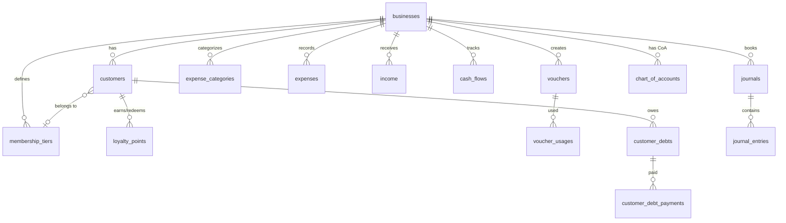

# VELORA — Database Architecture Part 3: CRM, Finance, Settings

---

## Module: CRM

### `customers`
| Column | Type | Constraints | Description |
|--------|------|-------------|-------------|
| id | CHAR(36) | PK | |
| business_id | CHAR(36) | FK→businesses | |
| membership_tier_id | CHAR(36) | NULLABLE, FK→membership_tiers | |
| name | VARCHAR(150) | NOT NULL | |
| email | VARCHAR(150) | NULLABLE | |
| phone | VARCHAR(20) | NULLABLE | |
| gender | VARCHAR(10) | NULLABLE | Enum: male, female, other |
| birth_date | DATE | NULLABLE | |
| address | TEXT | NULLABLE | |
| city | VARCHAR(100) | NULLABLE | |
| member_code | VARCHAR(30) | NULLABLE | Membership card number |
| points_balance | INT UNSIGNED | DEFAULT 0 | Current loyalty points |
| total_spent | BIGINT UNSIGNED | DEFAULT 0 | Lifetime spending |
| total_transactions | INT UNSIGNED | DEFAULT 0 | Lifetime transaction count |
| last_transaction_at | TIMESTAMP | NULLABLE | |
| notes | TEXT | NULLABLE | |
| is_active | TINYINT(1) | DEFAULT 1 | |
| created_at | TIMESTAMP | | |
| updated_at | TIMESTAMP | | |
| deleted_at | TIMESTAMP | NULLABLE | |

**Indexes**: `(business_id, phone)`, `(business_id, member_code)`, `(business_id, email)`

### `membership_tiers`
| Column | Type | Constraints | Description |
|--------|------|-------------|-------------|
| id | CHAR(36) | PK | |
| business_id | CHAR(36) | FK→businesses | |
| name | VARCHAR(50) | NOT NULL | e.g., "Silver", "Gold", "Platinum" |
| slug | VARCHAR(50) | NOT NULL | |
| min_spent | BIGINT UNSIGNED | DEFAULT 0 | Min spending to qualify |
| min_transactions | INT UNSIGNED | DEFAULT 0 | Min transactions |
| discount_percentage | DECIMAL(5,2) | DEFAULT 0 | Auto discount for tier |
| points_multiplier | DECIMAL(5,2) | DEFAULT 1 | Points earning multiplier |
| benefits | JSON | NULLABLE | List of benefits |
| color | VARCHAR(7) | NULLABLE | e.g., "#C0C0C0" |
| sort_order | INT | DEFAULT 0 | |
| is_active | TINYINT(1) | DEFAULT 1 | |
| created_at | TIMESTAMP | | |
| updated_at | TIMESTAMP | | |

### `loyalty_points`
| Column | Type | Constraints | Description |
|--------|------|-------------|-------------|
| id | CHAR(36) | PK | |
| business_id | CHAR(36) | FK→businesses | |
| customer_id | CHAR(36) | FK→customers | |
| transaction_id | CHAR(36) | NULLABLE, FK→transactions | |
| type | VARCHAR(20) | NOT NULL | Enum: earned, redeemed, expired, adjusted, bonus |
| points | INT | NOT NULL | Positive=earn, Negative=spend |
| balance_after | INT UNSIGNED | NOT NULL | Balance after this entry |
| description | VARCHAR(255) | NULLABLE | |
| expires_at | TIMESTAMP | NULLABLE | |
| created_at | TIMESTAMP | | |

**Indexes**: `(customer_id, created_at)`, `(business_id, expires_at)`

> [!NOTE]
> `loyalty_points` is a **ledger** (append-only). Current balance = `customers.points_balance` (denormalized for speed).

### `vouchers`
| Column | Type | Constraints | Description |
|--------|------|-------------|-------------|
| id | CHAR(36) | PK | |
| business_id | CHAR(36) | FK→businesses | |
| code | VARCHAR(30) | NOT NULL | Voucher code |
| name | VARCHAR(100) | NOT NULL | |
| type | VARCHAR(20) | NOT NULL | Enum: percentage, fixed |
| value | DECIMAL(15,2) | NOT NULL | |
| min_purchase | BIGINT UNSIGNED | DEFAULT 0 | |
| max_discount | BIGINT UNSIGNED | NULLABLE | |
| usage_limit | INT | NULLABLE | |
| usage_per_customer | INT | NULLABLE | |
| used_count | INT UNSIGNED | DEFAULT 0 | |
| starts_at | TIMESTAMP | NULLABLE | |
| ends_at | TIMESTAMP | NULLABLE | |
| is_active | TINYINT(1) | DEFAULT 1 | |
| applicable_tiers | JSON | NULLABLE | Restrict to membership tiers |
| applicable_products | JSON | NULLABLE | Restrict to products |
| created_at | TIMESTAMP | | |
| updated_at | TIMESTAMP | | |

**Indexes**: `UNIQUE(business_id, code)`

### `voucher_usages`
| Column | Type | Constraints | Description |
|--------|------|-------------|-------------|
| id | CHAR(36) | PK | |
| voucher_id | CHAR(36) | FK→vouchers | |
| customer_id | CHAR(36) | NULLABLE, FK→customers | |
| transaction_id | CHAR(36) | FK→transactions | |
| discount_amount | BIGINT UNSIGNED | NOT NULL | |
| created_at | TIMESTAMP | | |

### `customer_debts`
| Column | Type | Constraints | Description |
|--------|------|-------------|-------------|
| id | CHAR(36) | PK | |
| business_id | CHAR(36) | FK→businesses | |
| customer_id | CHAR(36) | FK→customers | |
| transaction_id | CHAR(36) | FK→transactions | |
| total_amount | BIGINT UNSIGNED | NOT NULL | |
| paid_amount | BIGINT UNSIGNED | DEFAULT 0 | |
| remaining_amount | BIGINT UNSIGNED | GENERATED | |
| due_date | DATE | NULLABLE | |
| status | VARCHAR(20) | DEFAULT 'unpaid' | Enum: unpaid, partial, paid, overdue, written_off |
| created_at | TIMESTAMP | | |
| updated_at | TIMESTAMP | | |

### `customer_debt_payments`
| Column | Type | Constraints | Description |
|--------|------|-------------|-------------|
| id | CHAR(36) | PK | |
| customer_debt_id | CHAR(36) | FK→customer_debts | |
| amount | BIGINT UNSIGNED | NOT NULL | |
| payment_method_id | CHAR(36) | FK→payment_methods | |
| reference | VARCHAR(100) | NULLABLE | |
| received_by | CHAR(36) | FK→users | |
| paid_at | TIMESTAMP | NOT NULL | |
| created_at | TIMESTAMP | | |

---

## Module: Finance

### `expense_categories`
| Column | Type | Constraints | Description |
|--------|------|-------------|-------------|
| id | CHAR(36) | PK | |
| business_id | CHAR(36) | FK→businesses | |
| parent_id | CHAR(36) | NULLABLE, FK→expense_categories | |
| name | VARCHAR(100) | NOT NULL | e.g., "Operasional", "Gaji", "Sewa" |
| slug | VARCHAR(100) | NOT NULL | |
| is_active | TINYINT(1) | DEFAULT 1 | |
| created_at | TIMESTAMP | | |
| updated_at | TIMESTAMP | | |

### `expenses`
| Column | Type | Constraints | Description |
|--------|------|-------------|-------------|
| id | CHAR(36) | PK | |
| business_id | CHAR(36) | FK→businesses | |
| branch_id | CHAR(36) | FK→branches | |
| category_id | CHAR(36) | FK→expense_categories | |
| expense_number | VARCHAR(50) | UNIQUE | |
| description | VARCHAR(500) | NOT NULL | |
| amount | BIGINT UNSIGNED | NOT NULL | |
| tax_amount | BIGINT UNSIGNED | DEFAULT 0 | |
| total_amount | BIGINT UNSIGNED | NOT NULL | |
| expense_date | DATE | NOT NULL | |
| payment_method_id | CHAR(36) | NULLABLE, FK→payment_methods | |
| receipt_url | VARCHAR(500) | NULLABLE | Uploaded receipt |
| status | VARCHAR(20) | DEFAULT 'approved' | Enum: draft, pending, approved, rejected |
| approved_by | CHAR(36) | NULLABLE, FK→users | |
| created_by | CHAR(36) | FK→users | |
| note | TEXT | NULLABLE | |
| created_at | TIMESTAMP | | |
| updated_at | TIMESTAMP | | |

### `income`
| Column | Type | Constraints | Description |
|--------|------|-------------|-------------|
| id | CHAR(36) | PK | |
| business_id | CHAR(36) | FK→businesses | |
| branch_id | CHAR(36) | FK→branches | |
| income_number | VARCHAR(50) | UNIQUE | |
| source | VARCHAR(50) | NOT NULL | Enum: sales, other, interest, refund_received |
| description | VARCHAR(500) | NOT NULL | |
| amount | BIGINT UNSIGNED | NOT NULL | |
| income_date | DATE | NOT NULL | |
| reference_type | VARCHAR(100) | NULLABLE | transaction, etc. |
| reference_id | CHAR(36) | NULLABLE | |
| payment_method_id | CHAR(36) | NULLABLE | |
| created_by | CHAR(36) | FK→users | |
| created_at | TIMESTAMP | | |
| updated_at | TIMESTAMP | | |

### `cash_flows`
| Column | Type | Constraints | Description |
|--------|------|-------------|-------------|
| id | CHAR(36) | PK | |
| business_id | CHAR(36) | FK→businesses | |
| branch_id | CHAR(36) | FK→branches | |
| type | VARCHAR(10) | NOT NULL | Enum: in, out |
| category | VARCHAR(30) | NOT NULL | Enum: sales, purchase, expense, debt_payment, debt_received, refund, other |
| amount | BIGINT UNSIGNED | NOT NULL | |
| balance_after | BIGINT | NOT NULL | Running balance |
| reference_type | VARCHAR(100) | NULLABLE | Source model |
| reference_id | CHAR(36) | NULLABLE | |
| description | VARCHAR(500) | NULLABLE | |
| flow_date | DATE | NOT NULL | |
| created_by | CHAR(36) | NULLABLE, FK→users | |
| created_at | TIMESTAMP | | |

**Indexes**: `(business_id, branch_id, flow_date)`, `(business_id, type, flow_date)`

> [!NOTE]
> `cash_flows` is auto-populated via events. Every financial transaction creates a cash flow entry.

### `journals`
| Column | Type | Constraints | Description |
|--------|------|-------------|-------------|
| id | CHAR(36) | PK | |
| business_id | CHAR(36) | FK→businesses | |
| branch_id | CHAR(36) | NULLABLE | |
| journal_number | VARCHAR(50) | UNIQUE | |
| journal_date | DATE | NOT NULL | |
| description | VARCHAR(500) | NOT NULL | |
| reference_type | VARCHAR(100) | NULLABLE | |
| reference_id | CHAR(36) | NULLABLE | |
| total_debit | BIGINT UNSIGNED | DEFAULT 0 | |
| total_credit | BIGINT UNSIGNED | DEFAULT 0 | |
| is_auto | TINYINT(1) | DEFAULT 0 | System-generated |
| status | VARCHAR(20) | DEFAULT 'posted' | Enum: draft, posted, voided |
| created_by | CHAR(36) | FK→users | |
| created_at | TIMESTAMP | | |
| updated_at | TIMESTAMP | | |

### `journal_entries`
| Column | Type | Constraints | Description |
|--------|------|-------------|-------------|
| id | CHAR(36) | PK | |
| journal_id | CHAR(36) | FK→journals | |
| account_code | VARCHAR(20) | NOT NULL | CoA code e.g., "1-1001" |
| account_name | VARCHAR(100) | NOT NULL | e.g., "Kas" |
| debit | BIGINT UNSIGNED | DEFAULT 0 | |
| credit | BIGINT UNSIGNED | DEFAULT 0 | |
| description | VARCHAR(255) | NULLABLE | |
| created_at | TIMESTAMP | | |

### `chart_of_accounts`
| Column | Type | Constraints | Description |
|--------|------|-------------|-------------|
| id | CHAR(36) | PK | |
| business_id | CHAR(36) | FK→businesses | |
| parent_id | CHAR(36) | NULLABLE | |
| code | VARCHAR(20) | NOT NULL | e.g., "1-1001" |
| name | VARCHAR(100) | NOT NULL | |
| type | VARCHAR(20) | NOT NULL | Enum: asset, liability, equity, revenue, expense, cogs |
| is_system | TINYINT(1) | DEFAULT 0 | |
| is_active | TINYINT(1) | DEFAULT 1 | |
| balance | BIGINT | DEFAULT 0 | Current balance |
| created_at | TIMESTAMP | | |
| updated_at | TIMESTAMP | | |

**Indexes**: `UNIQUE(business_id, code)`

---

## Module: Settings

### `business_settings`
| Column | Type | Constraints | Description |
|--------|------|-------------|-------------|
| id | CHAR(36) | PK | |
| business_id | CHAR(36) | FK→businesses | |
| group | VARCHAR(30) | NOT NULL | e.g., "pos", "tax", "invoice", "stock", "notification" |
| key | VARCHAR(50) | NOT NULL | |
| value | TEXT | NULLABLE | |
| created_at | TIMESTAMP | | |
| updated_at | TIMESTAMP | | |

**Indexes**: `UNIQUE(business_id, group, key)`

**Default settings groups and keys**:

| Group | Key | Default | Description |
|-------|-----|---------|-------------|
| pos | receipt_header | "" | Receipt top text |
| pos | receipt_footer | "Terima kasih!" | Receipt bottom text |
| pos | auto_print_receipt | "true" | |
| pos | allow_negative_stock | "false" | Sell below 0? |
| pos | default_tax_id | null | |
| pos | rounding_method | "none" | none, round_up, round_down, round_nearest |
| pos | rounding_precision | "100" | Round to nearest X |
| stock | costing_method | "avg" | avg, fifo |
| stock | low_stock_alert | "true" | |
| tax | default_tax_rate | "11" | PPN default |
| invoice | prefix | "INV" | |
| invoice | auto_number | "true" | |
| notification | low_stock_email | "true" | |
| notification | expiry_alert_days | "30" | Days before expiry |

### `number_sequences`
| Column | Type | Constraints | Description |
|--------|------|-------------|-------------|
| id | CHAR(36) | PK | |
| business_id | CHAR(36) | FK→businesses | |
| type | VARCHAR(30) | NOT NULL | transaction, purchase, refund, transfer, etc. |
| prefix | VARCHAR(10) | NOT NULL | e.g., "TRX", "PO" |
| separator | VARCHAR(5) | DEFAULT '-' | |
| include_date | TINYINT(1) | DEFAULT 1 | Include YYYYMMDD |
| current_number | INT UNSIGNED | DEFAULT 0 | Auto-increment |
| padding | INT | DEFAULT 5 | Zero-pad length |
| reset_period | VARCHAR(10) | DEFAULT 'daily' | Enum: daily, monthly, yearly, never |
| last_reset_at | DATE | NULLABLE | |
| created_at | TIMESTAMP | | |
| updated_at | TIMESTAMP | | |

**Indexes**: `UNIQUE(business_id, type)`

---

## Relationship Diagram — CRM + Finance

---

## Master Table Count

| Module | Tables | Names |
|--------|--------|-------|
| **Tenant** | 5 | users, businesses, branches, business_user, branch_user |
| **Subscription** | 5 | subscription_plans, feature_limits, subscriptions, subscription_payments, subscription_logs |
| **Auth/Security** | 5 | roles, permissions, role_permission, activity_logs, audit_logs |
| **POS** | 7 | categories, brands, units, unit_conversions, products, product_variants, product_units, barcodes |
| **Inventory** | 9 | warehouses, product_warehouse, stock_movements, stock_transfers, stock_transfer_items, stock_opnames, stock_opname_items, stock_adjustments, stock_adjustment_items, batches |
| **Sales** | 9 | cashier_shifts, payment_methods, taxes, discounts, transactions, transaction_items, transaction_payments, refunds, refund_items |
| **Purchasing** | 5 | suppliers, purchases, purchase_items, supplier_debts, supplier_debt_payments |
| **CRM** | 7 | customers, membership_tiers, loyalty_points, vouchers, voucher_usages, customer_debts, customer_debt_payments |
| **Finance** | 6 | expense_categories, expenses, income, cash_flows, journals, journal_entries, chart_of_accounts |
| **Settings** | 2 | business_settings, number_sequences |
| **TOTAL** | **~60** | |

---

*Back to [Master Plan](file:///C:/Users/YP/.gemini/antigravity/brain/7880df49-c88e-4c8f-82bc-eb5a42cebb61/implementation_plan.md)*
