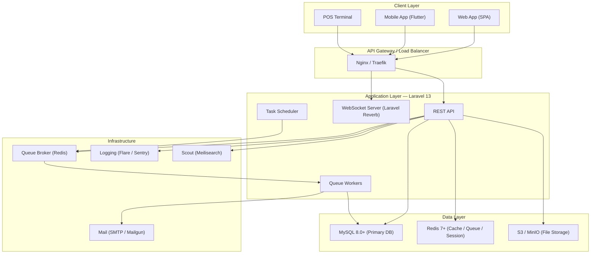
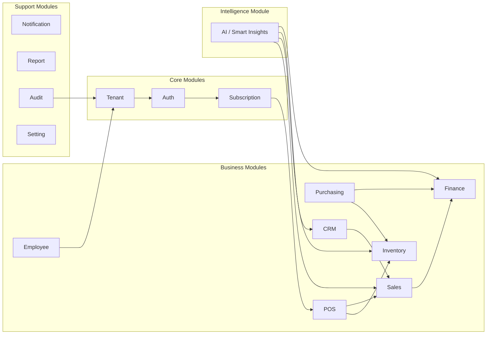
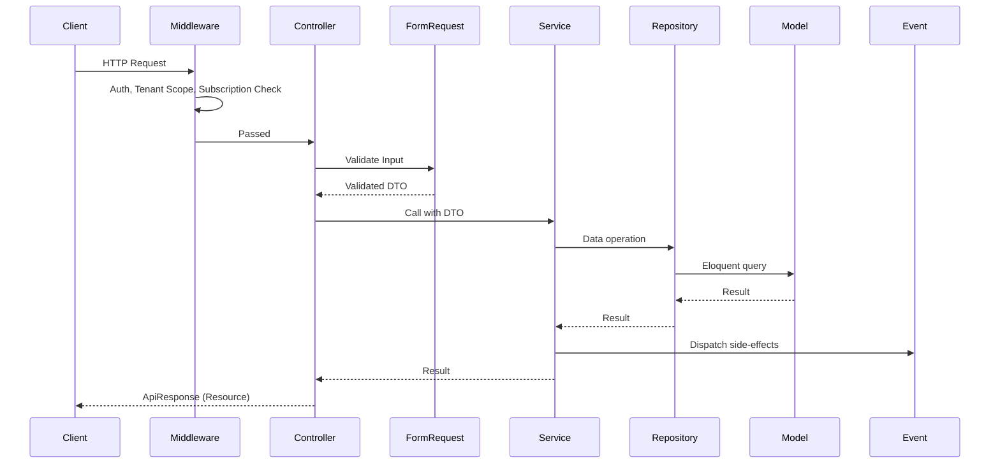

# VELORA — SaaS POS Enterprise Architecture Plan

> **Platform**: SaaS POS (Point of Sale) multi-tenant untuk UMKM  
> **Stack**: Laravel 13 (Stable, March 2026) · PHP 8.3+ · MySQL 8.0+ · Redis 7+  
> **Payment**: Midtrans (Snap API) · Manual Transfer + Auto-Charge  
> **Currency**: Multi-currency (default IDR)  
> **AI Engine**: OpenAI API (GPT-4o) + Local analytics  
> **Status**: Architecture Planning — No Code Yet

---

## Table of Contents

### This Document
| # | Section |
|---|---------|
| 1 | System Architecture (High-Level Diagram) |
| 2 | Modular Architecture (15 Modules) |
| 3 | Folder Structure (Domain-Driven) |
| 4 | API Response Standard |
| 5 | Naming & Coding Conventions |
| 6 | Service Layer & Repository Pattern |

### External Documents
| # | Document | Content |
|---|----------|---------|
| 7 | [DB Part 1](file:///C:/Users/YP/.gemini/antigravity/brain/7880df49-c88e-4c8f-82bc-eb5a42cebb61/database_architecture_part1.md) | Core SaaS, Subscription, Auth, POS tables |
| 8 | [DB Part 2](file:///C:/Users/YP/.gemini/antigravity/brain/7880df49-c88e-4c8f-82bc-eb5a42cebb61/database_architecture_part2.md) | Inventory, Sales, Purchasing tables |
| 9 | [DB Part 3](file:///C:/Users/YP/.gemini/antigravity/brain/7880df49-c88e-4c8f-82bc-eb5a42cebb61/database_architecture_part3.md) | CRM, Finance, Settings tables |
| 10 | [DB Addendum](file:///C:/Users/YP/.gemini/antigravity/brain/7880df49-c88e-4c8f-82bc-eb5a42cebb61/database_architecture_addendum.md) | Multi-currency, Midtrans, AI tables |
| 11 | [Infra Part 1](file:///C:/Users/YP/.gemini/antigravity/brain/7880df49-c88e-4c8f-82bc-eb5a42cebb61/infrastructure_architecture.md) | Multi-tenant, Subscription + Midtrans, Inventory, Roles |
| 12 | [Infra Part 2](file:///C:/Users/YP/.gemini/antigravity/brain/7880df49-c88e-4c8f-82bc-eb5a42cebb61/infrastructure_architecture_part2.md) | Financial, Events, Queue, Cache, Security, Audit, Scale |
| 13 | [AI Architecture](file:///C:/Users/YP/.gemini/antigravity/brain/7880df49-c88e-4c8f-82bc-eb5a42cebb61/ai_architecture.md) | 6 AI features, OpenAI integration, prompts, cost mgmt |
| 14 | [Walkthrough](file:///C:/Users/YP/.gemini/antigravity/brain/7880df49-c88e-4c8f-82bc-eb5a42cebb61/walkthrough.md) | Final summary, implementation phases, decisions |

---

## 1. System Architecture (High-Level)



### Key Decisions

| Concern | Decision | Rationale |
|---------|----------|-----------|
| **Database** | Single DB, tenant isolation via `business_id` column | Simplest for UMKM scale; avoids multi-DB overhead |
| **Auth** | Laravel Sanctum (token-based) | Ideal for SPA + Mobile API; no OAuth complexity needed |
| **Payment** | Midtrans Snap API (`midtrans/midtrans-php`) | Indonesian market leader; supports QRIS, VA, e-wallet, CC |
| **Billing** | Manual Transfer + Auto-Charge (dual mode) | User chooses; admin verifies manual; Midtrans auto-charges |
| **Currency** | Multi-currency, default IDR | `currencies` table + exchange rates; display always in user's currency |
| **AI** | OpenAI GPT-4o API + local analytics | Sales prediction, smart restock, natural language insights |
| **Realtime** | Laravel Reverb (WebSocket) | Native Laravel; POS needs realtime stock/transaction updates |
| **Queue** | Redis driver | Fast, reliable; supports priority queues |
| **Cache** | Redis with tagged cache | Per-tenant cache isolation via tags |
| **Search** | Laravel Scout + Meilisearch | Product search, barcode lookup, customer search |
| **Storage** | S3-compatible (MinIO for dev) | Product images, receipts, reports |
| **Monitoring** | Laravel Telescope (dev) + Sentry (prod) | Debug in dev, error tracking in prod |

---

## 2. Modular Architecture

VELORA uses a **Domain-Driven Modular Monolith** — each business domain is a self-contained module inside `app/Modules/`.



### Module List & Responsibilities

| Module | Namespace | Responsibilities |
|--------|-----------|-----------------|
| **Tenant** | `App\Modules\Tenant` | Business registration, branch management, tenant isolation |
| **Auth** | `App\Modules\Auth` | Login, registration, token management, password reset |
| **Subscription** | `App\Modules\Subscription` | Plans, billing, invoices, feature limits, grace period, trial |
| **POS** | `App\Modules\POS` | Products, variants, categories, brands, units, barcodes, unit conversion |
| **Inventory** | `App\Modules\Inventory` | Warehouses, stock movements, opname, adjustments, batches, expiry |
| **Sales** | `App\Modules\Sales` | Transactions, refunds, discounts, taxes, payment methods, shifts |
| **Purchasing** | `App\Modules\Purchasing` | Suppliers, purchase orders, receiving, supplier debts |
| **Finance** | `App\Modules\Finance` | Expenses, income, cash flows, journals, profit/loss |
| **CRM** | `App\Modules\CRM` | Customers, memberships, loyalty points, vouchers |
| **Employee** | `App\Modules\Employee` | Staff management, attendance, role assignment per branch |
| **Notification** | `App\Modules\Notification` | Email, push, in-app notifications |
| **Report** | `App\Modules\Report` | Sales reports, stock reports, financial reports, export |
| **Audit** | `App\Modules\Audit` | Activity logs, audit trails, data change history |
| **Setting** | `App\Modules\Setting` | Business settings, POS config, tax config, currency, rounding |
| **AI** | `App\Modules\AI` | Smart insights, sales forecasting, restock suggestions, natural language queries, anomaly detection |

### Inter-Module Communication Rules

1. **Modules communicate via Interfaces (Contracts)**, never direct model access across modules
2. **Events** are used for cross-module side-effects (e.g., `TransactionCompleted` → update stock, update loyalty)
3. **Each module has its own** Service, Repository, DTOs, Requests, Resources, and Routes
4. **Shared kernel**: Only `App\Shared\` contains cross-cutting concerns (traits, helpers, base classes)

---

## 3. Folder Structure

```
velora_project/
├── app/
│   ├── Modules/
│   │   ├── Tenant/
│   │   │   ├── Controllers/
│   │   │   │   └── BusinessController.php
│   │   │   │   └── BranchController.php
│   │   │   ├── Models/
│   │   │   │   └── Business.php
│   │   │   │   └── Branch.php
│   │   │   ├── Services/
│   │   │   │   └── BusinessService.php
│   │   │   │   └── BranchService.php
│   │   │   ├── Repositories/
│   │   │   │   ├── Contracts/
│   │   │   │   │   └── BusinessRepositoryInterface.php
│   │   │   │   └── Eloquent/
│   │   │   │       └── BusinessRepository.php
│   │   │   ├── DTOs/
│   │   │   │   └── CreateBusinessDTO.php
│   │   │   ├── Requests/
│   │   │   │   └── StoreBusinessRequest.php
│   │   │   ├── Resources/
│   │   │   │   └── BusinessResource.php
│   │   │   ├── Events/
│   │   │   │   └── BusinessCreated.php
│   │   │   ├── Listeners/
│   │   │   │   └── SetupDefaultBranch.php
│   │   │   ├── Policies/
│   │   │   │   └── BusinessPolicy.php
│   │   │   ├── Enums/
│   │   │   │   └── BusinessStatus.php
│   │   │   ├── Exceptions/
│   │   │   │   └── BusinessNotFoundException.php
│   │   │   └── Routes/
│   │   │       └── api.php
│   │   │
│   │   ├── Auth/
│   │   │   └── ... (same structure)
│   │   ├── Subscription/
│   │   │   └── ...
│   │   ├── POS/
│   │   │   └── ...
│   │   ├── Inventory/
│   │   │   └── ...
│   │   ├── Sales/
│   │   │   └── ...
│   │   ├── Purchasing/
│   │   │   └── ...
│   │   ├── Finance/
│   │   │   └── ...
│   │   ├── CRM/
│   │   │   └── ...
│   │   ├── Employee/
│   │   │   └── ...
│   │   ├── Notification/
│   │   │   └── ...
│   │   ├── Report/
│   │   │   └── ...
│   │   ├── Audit/
│   │   │   └── ...
│   │   ├── Setting/
│   │   │   └── ...
│   │   └── AI/
│   │       ├── Controllers/
│   │       │   └── InsightController.php
│   │       │   └── ForecastController.php
│   │       │   └── ChatController.php
│   │       ├── Services/
│   │       │   └── AIInsightService.php
│   │       │   └── SalesForecastService.php
│   │       │   └── RestockSuggestionService.php
│   │       │   └── NaturalLanguageService.php
│   │       │   └── AnomalyDetectionService.php
│   │       ├── Repositories/
│   │       │   ├── Contracts/
│   │       │   └── Eloquent/
│   │       ├── Models/
│   │       │   └── AIQuery.php
│   │       │   └── Forecast.php
│   │       │   └── InsightCache.php
│   │       ├── DTOs/
│   │       ├── Jobs/
│   │       │   └── GenerateDailyForecast.php
│   │       │   └── DetectAnomalies.php
│   │       ├── Prompts/
│   │       │   └── SalesAnalysisPrompt.php
│   │       │   └── RestockPrompt.php
│   │       │   └── NaturalQueryPrompt.php
│   │       └── Routes/
│   │           └── api.php
│   │
│   ├── Shared/
│   │   ├── Traits/
│   │   │   ├── BelongsToBusiness.php
│   │   │   ├── BelongsToBranch.php
│   │   │   ├── HasUuid.php
│   │   │   ├── Auditable.php
│   │   │   └── Filterable.php
│   │   ├── Helpers/
│   │   │   ├── MoneyHelper.php
│   │   │   └── CodeGenerator.php
│   │   ├── Middleware/
│   │   │   ├── EnsureTenantScope.php
│   │   │   ├── EnsureActiveSubscription.php
│   │   │   ├── EnsureBranchAccess.php
│   │   │   └── CheckFeatureLimit.php
│   │   ├── Enums/
│   │   │   └── Status.php
│   │   ├── Exceptions/
│   │   │   └── VeloraException.php
│   │   ├── Resources/
│   │   │   └── ApiResponse.php
│   │   └── Scopes/
│   │       └── BusinessScope.php
│   │
│   ├── Providers/
│   │   ├── AppServiceProvider.php
│   │   ├── ModuleServiceProvider.php
│   │   ├── RepositoryServiceProvider.php
│   │   └── EventServiceProvider.php
│   │
│   └── Console/
│       └── Commands/
│           ├── CheckExpiredSubscriptions.php
│           ├── CleanAuditLogs.php
│           └── GenerateDailyReport.php
│
├── database/
│   ├── migrations/
│   │   ├── tenant/
│   │   ├── pos/
│   │   ├── inventory/
│   │   ├── sales/
│   │   ├── purchasing/
│   │   ├── finance/
│   │   ├── crm/
│   │   └── audit/
│   ├── seeders/
│   │   ├── RolePermissionSeeder.php
│   │   ├── SubscriptionPlanSeeder.php
│   │   ├── UnitSeeder.php
│   │   └── TaxSeeder.php
│   └── factories/
│
├── config/
│   ├── velora.php          # App-specific config
│   ├── subscription.php    # Plan limits & features
│   └── pos.php             # POS-specific config
│
├── routes/
│   └── api.php             # Master route file (loads module routes)
│
├── tests/
│   ├── Unit/
│   │   └── Modules/
│   │       ├── Tenant/
│   │       ├── POS/
│   │       └── ...
│   └── Feature/
│       └── Modules/
│           ├── Tenant/
│           ├── POS/
│           └── ...
│
└── storage/
    └── exports/
```

---

## 4. API Response Standard

### Success Response

```json
{
    "success": true,
    "message": "Product created successfully",
    "data": {
        "id": "uuid-here",
        "name": "Kopi Susu",
        "sku": "KS-001"
    },
    "meta": {
        "timestamp": "2026-05-18T11:00:00+07:00",
        "request_id": "req_abc123"
    }
}
```

### Paginated Response

```json
{
    "success": true,
    "message": "Products retrieved",
    "data": [ ... ],
    "meta": {
        "current_page": 1,
        "per_page": 15,
        "total": 150,
        "last_page": 10,
        "timestamp": "2026-05-18T11:00:00+07:00"
    }
}
```

### Error Response

```json
{
    "success": false,
    "message": "Validation failed",
    "errors": {
        "name": ["The name field is required."],
        "price": ["Price must be a positive number."]
    },
    "meta": {
        "timestamp": "2026-05-18T11:00:00+07:00",
        "error_code": "VALIDATION_ERROR",
        "request_id": "req_abc123"
    }
}
```

### HTTP Status Codes Used

| Code | Usage |
|------|-------|
| `200` | Success (GET, PUT, PATCH) |
| `201` | Created (POST) |
| `204` | No Content (DELETE) |
| `400` | Bad Request |
| `401` | Unauthenticated |
| `403` | Forbidden (no permission / subscription expired) |
| `404` | Not Found |
| `409` | Conflict (duplicate, concurrent edit) |
| `422` | Validation Error |
| `429` | Rate Limited |
| `500` | Server Error |

### Custom Error Codes

| Code | Meaning |
|------|---------|
| `SUBSCRIPTION_EXPIRED` | Subscription expired, access locked |
| `SUBSCRIPTION_LIMIT_REACHED` | Feature limit hit (e.g., max products) |
| `INSUFFICIENT_STOCK` | Stock not enough for sale |
| `BRANCH_ACCESS_DENIED` | User has no access to this branch |
| `SHIFT_NOT_OPEN` | No active cashier shift |
| `TRANSACTION_LOCKED` | Transaction already finalized |

---

## 5. Naming Conventions

### Database

| Element | Convention | Example |
|---------|-----------|---------|
| Table | `snake_case`, plural | `stock_movements` |
| Column | `snake_case` | `selling_price` |
| Primary Key | `id` (UUID) | `id` |
| Foreign Key | `{singular_table}_id` | `business_id` |
| Pivot Table | alphabetical singular | `product_warehouse` |
| Boolean | `is_` / `has_` prefix | `is_active`, `has_variants` |
| Timestamp | `_at` suffix | `expired_at`, `verified_at` |
| Money columns | `_amount` suffix, `BIGINT` (store in cents/smallest unit) | `total_amount` |
| Enum columns | descriptive name | `status`, `type`, `payment_method` |

### PHP / Laravel

| Element | Convention | Example |
|---------|-----------|---------|
| Model | `PascalCase`, singular | `StockMovement` |
| Controller | `PascalCase` + `Controller` | `ProductController` |
| Service | `PascalCase` + `Service` | `InventoryService` |
| Repository | `PascalCase` + `Repository` | `ProductRepository` |
| Interface | `PascalCase` + `Interface` | `ProductRepositoryInterface` |
| Request | `Store/Update` + `Model` + `Request` | `StoreProductRequest` |
| Resource | `PascalCase` + `Resource` | `ProductResource` |
| Event | Past tense verb | `TransactionCompleted` |
| Listener | Action verb | `UpdateStockAfterSale` |
| Job | Action verb | `ProcessSubscriptionExpiry` |
| Enum | `PascalCase` | `PaymentStatus` |
| DTO | `PascalCase` + `DTO` | `CreateProductDTO` |
| Policy | `PascalCase` + `Policy` | `ProductPolicy` |
| Middleware | Descriptive | `EnsureActiveSubscription` |
| Trait | Adjective/capability | `BelongsToBusiness`, `Auditable` |
| Config key | `snake_case` | `velora.max_branches` |
| Route | `kebab-case` for URI, `camelCase` for name | `/stock-movements`, `stockMovements.index` |

### API Routes

| Verb | URI Pattern | Name | Action |
|------|-------------|------|--------|
| GET | `/api/v1/{resource}` | `{resource}.index` | List |
| POST | `/api/v1/{resource}` | `{resource}.store` | Create |
| GET | `/api/v1/{resource}/{id}` | `{resource}.show` | Detail |
| PUT | `/api/v1/{resource}/{id}` | `{resource}.update` | Full update |
| PATCH | `/api/v1/{resource}/{id}` | `{resource}.patch` | Partial update |
| DELETE | `/api/v1/{resource}/{id}` | `{resource}.destroy` | Delete |

---

## 6. Coding Conventions

### Controller Rules
- **Thin controllers** — max 5 resource methods + max 3 custom actions
- Controllers only handle: validate → call service → return resource
- No business logic in controllers
- Always return `ApiResponse`

### Service Layer Rules
- All business logic lives in Services
- Services call Repositories for data access
- Services dispatch Events for side-effects
- Services throw custom Exceptions
- Services receive DTOs, not raw arrays

### Repository Pattern

```
Interface (Contract)         →  Eloquent Implementation
ProductRepositoryInterface   →  ProductRepository
    ├── findById(string $id): ?Product
    ├── findBySku(string $sku): ?Product
    ├── listForBusiness(string $businessId, array $filters): LengthAwarePaginator
    ├── create(CreateProductDTO $dto): Product
    ├── update(string $id, UpdateProductDTO $dto): Product
    └── delete(string $id): bool
```

**Binding** in `RepositoryServiceProvider`:
```
ProductRepositoryInterface::class => ProductRepository::class
```

### Request Flow



### Money Handling
- All money stored as `BIGINT` in **smallest currency unit** (e.g., IDR → no decimals, but store as integer)
- Use `MoneyHelper` for formatting: `MoneyHelper::format(150000)` → `"Rp 150.000"`
- Never use `FLOAT` or `DOUBLE` for money

### UUID Strategy
- All primary keys use **UUID v7** (time-ordered for index performance)
- Generated at application level via `HasUuid` trait

---

## Decisions Finalized ✅

| Question | Decision |
|----------|----------|
| **Framework** | Laravel 13 (Stable, released March 17, 2026) — PHP 8.3+ |
| **Payment Gateway** | Midtrans Snap API (`midtrans/midtrans-php`) |
| **Currency** | Multi-currency with IDR as default |
| **Offline POS** | Not needed — online only, subscription-gated |
| **Billing Mode** | Dual: Manual Transfer (admin verify) + Auto-Charge (Midtrans) |
| **AI Integration** | Yes — OpenAI GPT-4o for smart business insights |

## Remaining Open Questions

> [!WARNING]
> 1. **Frontend Stack**: Vue/React SPA, Flutter, or Blade? (affects API design)
> 2. **Receipt Printing**: Do you need thermal printer integration (ESC/POS protocol)?
> 3. **Deployment Target**: VPS, Docker, or managed cloud (AWS/GCP)?
> 4. **OpenAI API Key**: Platform-level key (Velora pays) or per-tenant key (each business provides their own)?

---

## Verification Plan

### Automated Tests
- Unit tests per module (Service + Repository layer)
- Feature tests for every API endpoint
- `php artisan test --parallel`

### Manual Verification
- Postman collection for full API testing
- Database diagram visual verification against ERD
- Load testing with JMeter for concurrent POS transactions

---

*See [Walkthrough](file:///C:/Users/YP/.gemini/antigravity/brain/7880df49-c88e-4c8f-82bc-eb5a42cebb61/walkthrough.md) for complete document map and implementation phases.*
