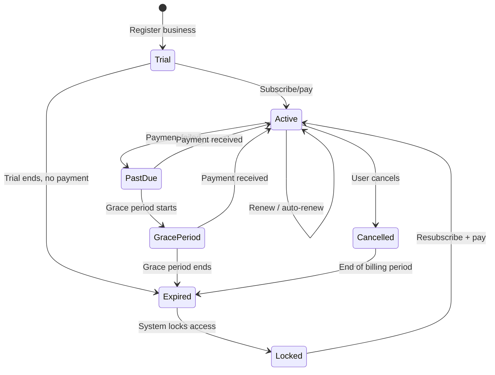
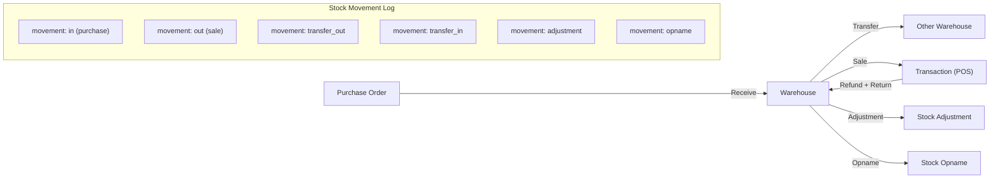
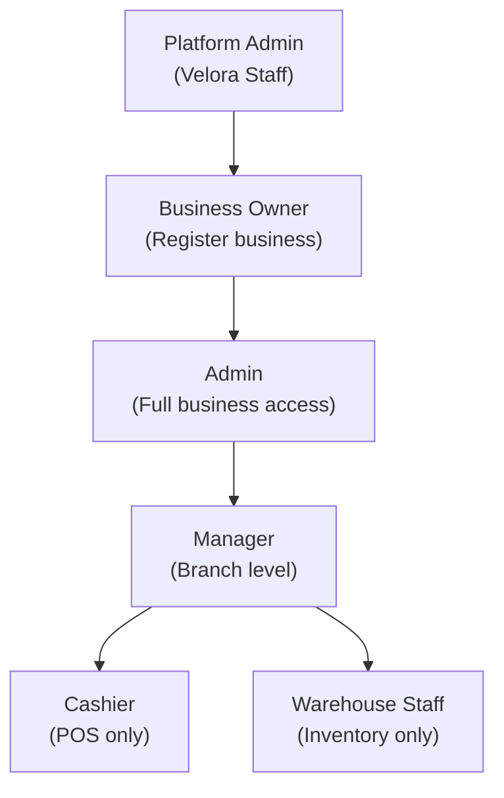

# VELORA — Infrastructure Architecture Part 1

> Multi-Tenant, Subscription (+ Midtrans + Dual Billing), Inventory, Role/Permission, Multi-Currency

---

## 1. Multi-Tenant Strategy

### Approach: Single Database, Column Isolation

```
┌──────────────────────────────────────────────────┐
│                  Single MySQL DB                  │
│                                                    │
│  ┌─────────┐  ┌─────────┐  ┌─────────┐           │
│  │ Toko A  │  │ Toko B  │  │ Toko C  │  ← All    │
│  │ biz_id  │  │ biz_id  │  │ biz_id  │    in one  │
│  │ = uuid1 │  │ = uuid2 │  │ = uuid3 │    DB      │
│  └─────────┘  └─────────┘  └─────────┘           │
└──────────────────────────────────────────────────┘
```

**Why single DB?**
- UMKM target = thousands of tenants, not millions
- Simplifies deployment, migrations, backups
- No cross-DB query complexity
- Easy to upgrade to DB-per-tenant later if needed

### Isolation Implementation

**1. Global Scope (Auto-filter)**
```
// BelongsToBusiness trait → auto-applies BusinessScope
// Every query on tenant-scoped models automatically adds:
// WHERE business_id = {current_user_business_id}
```

**2. Middleware Stack**
```
EnsureTenantScope     → Sets business_id in request context
EnsureBranchAccess    → Validates user can access this branch
EnsureActiveSubscription → Checks subscription status
CheckFeatureLimit     → Validates feature usage limits
```

**3. Model Trait**
```
trait BelongsToBusiness {
    - Automatically adds BusinessScope (global scope)
    - Auto-sets business_id on create
    - Prevents cross-tenant data leaks
}
```

**4. Data Isolation Guarantee**
- All tenant-scoped models use `BelongsToBusiness` trait
- Global scope ensures no query ever returns another tenant's data
- Foreign key constraints as safety net
- Unit tests verify tenant isolation per model

### Sub-Tenancy: Branch Level

```
Business (Tenant)
  └── Branch 1 (Sub-tenant)
  │     └── Warehouse A
  │     └── Cashier Shifts
  └── Branch 2 (Sub-tenant)
        └── Warehouse B
        └── Cashier Shifts
```

- Branch isolation is **optional** per endpoint (some reports need all branches)
- `BelongsToBranch` trait for branch-scoped data
- `EnsureBranchAccess` middleware checks `branch_user` pivot

---

## 2. Subscription Architecture

### Plan Tiers

| Plan | Price (IDR/mo) | Products | Branches | Users | Warehouses | Features |
|------|---------------|----------|----------|-------|------------|----------|
| **Trial** | Free (14 days) | 50 | 1 | 2 | 1 | Basic POS |
| **Starter** | 99.000 | 500 | 1 | 5 | 1 | POS + Basic Report |
| **Professional** | 249.000 | 5.000 | 3 | 15 | 3 | + Multi-branch, Inventory, CRM |
| **Enterprise** | 499.000 | Unlimited | 10 | 50 | 10 | + Advanced Reports, API, Multi-warehouse |
| **Custom** | Negotiable | Unlimited | Unlimited | Unlimited | Unlimited | Full features |

### Subscription Lifecycle



### Feature Gating Implementation

```
Middleware: CheckFeatureLimit
  1. Get current subscription → plan → feature_limits
  2. Check feature_key against current usage
  3. Example: "max_products" = 500
     - Count products for business
     - If count >= 500, reject with SUBSCRIPTION_LIMIT_REACHED
  4. Cacheable: feature limits cached per business (tagged cache)
```

### Automated Scheduler Jobs

| Schedule | Job | Action |
|----------|-----|--------|
| Every hour | `CheckExpiredTrials` | Trial → Expired if past trial_ends_at |
| Every hour | `CheckExpiredSubscriptions` | Active → Expired if past ends_at + grace |
| Daily | `LockExpiredBusinesses` | Expired → Lock business, set locked_at |
| Daily | `SendExpiryReminders` | Email 7, 3, 1 day before expiry |
| Daily | `ProcessAutoRenewals` | Create payment for auto-renew subscriptions |

### Lock Behavior When Expired
- **Blocked**: Create transactions, products, purchases, any write operations
- **Allowed**: View existing data, export reports, manage subscription/payment
- **UI**: Show banner "Subscription expired. Reactivate to continue."

### Midtrans Integration (Payment Gateway)

**Package**: `midtrans/midtrans-php` via Composer

```
Payment Flow:
┌────────────┐     ┌──────────────┐     ┌──────────────┐
│  Frontend   │────>│  VELORA API  │────>│   Midtrans   │
│ (Pay Button)│     │ (Create Snap)│     │  (Snap Page) │
└────────────┘     └──────────────┘     └──────┬───────┘
                                                │
                          ┌─────────────────────┘
                          │ Webhook notification
                          ▼
                   ┌──────────────┐
                   │  VELORA API  │──> Verify signature
                   │  /webhooks   │──> Update payment status
                   │  /midtrans   │──> Activate subscription
                   └──────────────┘
```

**Supported payment methods via Midtrans**:
- QRIS (GoPay, OVO, Dana, ShopeePay)
- Bank Transfer / Virtual Account (BCA, BNI, BRI, Mandiri, Permata)
- Credit/Debit Card
- E-Wallet
- Convenience Store (Alfamart, Indomaret)

**Webhook verification**: Always verify Midtrans notification using SHA-512 signature:
```
hash = SHA512(order_id + status_code + gross_amount + server_key)
```

### Dual Billing Mode

Users choose their preferred billing method:

| Mode | Flow | Activation |
|------|------|------------|
| **Auto-Charge** | Midtrans Snap → user pays → webhook confirms → auto-activate | Instant (webhook) |
| **Manual Transfer** | User transfers to Velora bank → uploads proof → admin verifies | 1-24 hours (manual review) |

**Auto-Renewal Logic**:
- Auto-charge mode: System creates Snap token 3 days before expiry → sends payment link via email/push
- Manual mode: System sends reminder email 7, 3, 1 days before expiry with bank details

### Multi-Currency Handling

```
Principle: "Store in business currency, display in any currency"

1. Each business sets primary currency (default: IDR)
2. All prices, transactions, and financial data stored in primary currency
3. Exchange rates updated daily (scheduled job or manual)
4. API can return converted amounts if requested:
   GET /products?currency=USD → prices shown in USD
5. Subscription plans priced per currency:
   - IDR: Rp 99.000/bulan
   - USD: $6.50/month (auto-calculated from exchange rate)
```

| Currency | Symbol | Decimals | Format Example |
|----------|--------|----------|----------------|
| IDR | Rp | 0 | Rp 150.000 |
| USD | $ | 2 | $9.99 |
| SGD | S$ | 2 | S$13.50 |
| MYR | RM | 2 | RM42.00 |
| EUR | € | 2 | €8.50 |

---

## 3. Inventory Architecture

### Multi-Warehouse Design

```
Business
├── Branch A (Store)
│   ├── Warehouse: Main Store (type: main)
│   └── Warehouse: Defect Store (type: defect)
├── Branch B (Store)
│   └── Warehouse: Branch B Store (type: main)
└── Branch C (Warehouse only)
    └── Warehouse: Central Gudang (type: main)
```

### Stock Flow Diagram



### Costing Methods

| Method | How | When |
|--------|-----|------|
| **Weighted Average (AVG)** | `new_avg = (old_qty × old_avg + new_qty × new_price) / (old_qty + new_qty)` | Default. Simple, good for most UMKM |
| **FIFO** | Sell from oldest batch first | When batch tracking enabled |

**Setting**: `business_settings.stock.costing_method` = `"avg"` or `"fifo"`

### Unit Conversion Engine

```
Product: Aqua 600ml
Base Unit: pcs

Product Units:
┌────────┬────────────────┬──────────┬──────────┐
│ Unit   │ Conversion     │ Buy Price│ Sell Price│
├────────┼────────────────┼──────────┼──────────┤
│ pcs    │ 1              │ 3.000    │ 4.000    │
│ pack   │ 1 pack = 6 pcs │ 16.000   │ 22.000   │
│ dus    │ 1 dus = 24 pcs │ 60.000   │ 80.000   │
│ karton │ 1 krt = 48 pcs │ 110.000  │ 150.000  │
└────────┴────────────────┴──────────┴──────────┘

Stock is ALWAYS stored in BASE UNIT (pcs).
When selling 2 dus → system calculates: 2 × 24 = 48 pcs deducted.
When purchasing 5 karton → system calculates: 5 × 48 = 240 pcs added.
```

### Batch & Expiry Tracking

```
Product: Susu Ultra 1L (is_track_batch=true, is_track_expiry=true)

Batches in Warehouse A:
┌────────────┬─────┬────────────┬─────────┐
│ Batch No   │ Qty │ Expired At │ Status  │
├────────────┼─────┼────────────┼─────────┤
│ LOT-001    │ 50  │ 2026-08-15 │ active  │
│ LOT-002    │ 100 │ 2026-12-01 │ active  │
│ LOT-003    │ 0   │ 2026-03-01 │ expired │
└────────────┴─────┴────────────┴─────────┘

FIFO: When selling, LOT-001 is deducted first (earliest expiry).
```

### Stock Locking for Concurrent POS

**Problem**: 2 cashiers sell the same product at the same time → race condition.

**Solution**: Pessimistic locking at stock deduction:
```
1. Begin Transaction (DB)
2. SELECT ... FROM product_warehouse WHERE product_id=X AND warehouse_id=Y FOR UPDATE
3. Check available_quantity >= requested
4. Deduct quantity
5. Create stock_movement
6. Commit Transaction
```

This uses MySQL row-level locking via `FOR UPDATE` to prevent double-deduction.

### Expiry Alert System

| Schedule | Job | Action |
|----------|-----|--------|
| Daily | `CheckExpiringBatches` | Find batches expiring within N days (configurable) |
| Daily | `MarkExpiredBatches` | Set status=expired for past-due batches |
| Weekly | `ExpiryReport` | Email summary of expiring products to business owners |

---

## 4. Role & Permission Strategy

### Role Hierarchy



### Permission Matrix (Key Permissions)

| Permission | Owner | Admin | Manager | Cashier | Warehouse |
|-----------|-------|-------|---------|---------|-----------|
| **products.view** | ✅ | ✅ | ✅ | ✅ | ✅ |
| **products.create** | ✅ | ✅ | ✅ | ❌ | ❌ |
| **products.update** | ✅ | ✅ | ✅ | ❌ | ❌ |
| **products.delete** | ✅ | ✅ | ❌ | ❌ | ❌ |
| **transactions.create** | ✅ | ✅ | ✅ | ✅ | ❌ |
| **transactions.void** | ✅ | ✅ | ✅ | ❌ | ❌ |
| **transactions.view_all** | ✅ | ✅ | ✅ | ❌ | ❌ |
| **transactions.view_own** | ✅ | ✅ | ✅ | ✅ | ❌ |
| **refunds.create** | ✅ | ✅ | ✅ | ❌ | ❌ |
| **inventory.view** | ✅ | ✅ | ✅ | ❌ | ✅ |
| **inventory.adjust** | ✅ | ✅ | ✅ | ❌ | ✅ |
| **inventory.opname** | ✅ | ✅ | ✅ | ❌ | ✅ |
| **purchases.create** | ✅ | ✅ | ✅ | ❌ | ❌ |
| **finance.view** | ✅ | ✅ | ✅ | ❌ | ❌ |
| **finance.manage** | ✅ | ✅ | ❌ | ❌ | ❌ |
| **reports.view** | ✅ | ✅ | ✅ | ❌ | ❌ |
| **reports.export** | ✅ | ✅ | ❌ | ❌ | ❌ |
| **employees.manage** | ✅ | ✅ | ❌ | ❌ | ❌ |
| **settings.manage** | ✅ | ✅ | ❌ | ❌ | ❌ |
| **subscription.manage** | ✅ | ❌ | ❌ | ❌ | ❌ |
| **branches.manage** | ✅ | ✅ | ❌ | ❌ | ❌ |

### Custom Roles
- Business owners can create **custom roles** with specific permissions
- Custom roles inherit from no template — fully manual permission selection
- System roles (owner, admin, etc.) cannot be deleted but can be cloned

### Permission Check Flow
```
1. Request comes in
2. Auth middleware → identify user
3. TenantScope middleware → set business context
4. Controller/Policy checks permission:
   - $user->hasPermission('products.create')
   - Check role_permission pivot for user's role in current business
5. If denied → 403 BRANCH_ACCESS_DENIED or generic 403
```

---

*Continued in [Part 2 — Financial, Event-Driven, Queue, Cache, Security, Audit, Scalability](file:///C:/Users/YP/.gemini/antigravity/brain/7880df49-c88e-4c8f-82bc-eb5a42cebb61/infrastructure_architecture_part2.md)*
